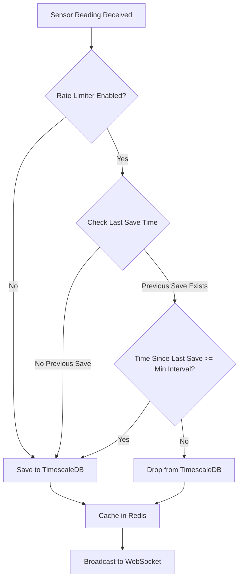

## Overview

The rate limiter controls how frequently sensor readings are saved to TimescaleDB, reducing database storage costs and improving query performance. It uses a configurable time-based throttling mechanism that works across multiple API pods using Redis.

<Note>
**Important**: Rate limiting only affects what is saved to TimescaleDB. All messages continue to be:
- Cached in Redis in real-time
- Broadcast to WebSocket clients immediately
- Available for live monitoring
</Note>

## Configuration

Configure the rate limiter in `application.yaml`:

```yaml
sensor:
  rate-limiter:
    enabled: true                  # Enable/disable rate limiting
    min-interval-seconds: 30       # Minimum seconds between saves per sensor
    use-redis: true                # Use Redis for multi-pod coordination
```

### Configuration Parameters

<ParamField path="enabled" type="boolean" default="false">
  Enable or disable the rate limiter. When disabled, all sensor readings are saved to TimescaleDB.
</ParamField>

<ParamField path="min-interval-seconds" type="integer" default="30">
  Minimum number of seconds that must elapse between saving readings from the same sensor. Readings received within this interval are dropped from TimescaleDB but still cached and broadcast.
</ParamField>

<ParamField path="use-redis" type="boolean" default="true">
  Use Redis for distributed rate limiting across multiple API pods. When `false`, uses in-memory cache (not recommended for production with multiple pods).
</ParamField>

## Get Rate Limiter Statistics

<CodeGroup>
```bash cURL
curl -X GET "http://api.example.com/api/v1/rate-limiter/stats"
```

```javascript JavaScript
fetch('http://api.example.com/api/v1/rate-limiter/stats')
  .then(response => response.json())
  .then(data => console.log(data));
```

```python Python
import requests

response = requests.get('http://api.example.com/api/v1/rate-limiter/stats')
print(response.json())
```
</CodeGroup>

### Endpoint

```
GET /api/v1/rate-limiter/stats
```

### Response

<ResponseField name="enabled" type="boolean" required>
  Whether the rate limiter is currently enabled
</ResponseField>

<ResponseField name="minIntervalSeconds" type="integer" required>
  Configured minimum interval between saves (in seconds)
</ResponseField>

<ResponseField name="useRedis" type="boolean" required>
  Whether Redis is being used for distributed rate limiting
</ResponseField>

<ResponseField name="totalReceived" type="integer" required>
  Total number of sensor readings received since API startup
</ResponseField>

<ResponseField name="totalSaved" type="integer" required>
  Total number of readings saved to TimescaleDB
</ResponseField>

<ResponseField name="totalDropped" type="integer" required>
  Total number of readings dropped due to rate limiting
</ResponseField>

<ResponseField name="dropRatePercent" type="number" required>
  Percentage of readings dropped (calculated as `totalDropped / totalReceived * 100`)
</ResponseField>

<ResponseField name="localCacheSize" type="integer" required>
  Number of entries in the local in-memory cache (only used when `useRedis` is false)
</ResponseField>

### Response Example

```json
{
  "enabled": true,
  "minIntervalSeconds": 30,
  "useRedis": true,
  "totalReceived": 1000000,
  "totalSaved": 100000,
  "totalDropped": 900000,
  "dropRatePercent": 90.0,
  "localCacheSize": 0
}
```

<Note>
In this example, 90% of readings were dropped from TimescaleDB. This is expected when sensors send data every 3 seconds but the interval is set to 30 seconds (90% reduction).
</Note>

## Reset Statistics

<CodeGroup>
```bash cURL
curl -X POST "http://api.example.com/api/v1/rate-limiter/reset-stats"
```

```javascript JavaScript
fetch('http://api.example.com/api/v1/rate-limiter/reset-stats', {
  method: 'POST'
})
.then(response => response.json())
.then(data => console.log(data));
```

```python Python
import requests

response = requests.post('http://api.example.com/api/v1/rate-limiter/reset-stats')
print(response.json())
```
</CodeGroup>

### Endpoint

```
POST /api/v1/rate-limiter/reset-stats
```

### Response

<ResponseField name="status" type="string" required>
  Status of the operation (`ok`)
</ResponseField>

<ResponseField name="message" type="string" required>
  Confirmation message
</ResponseField>

### Response Example

```json
{
  "status": "ok",
  "message": "Estadísticas reseteadas"
}
```

<Note>
Resetting statistics only clears the counters (`totalReceived`, `totalSaved`, `totalDropped`). It does not affect the rate limiting behavior or Redis timestamps.
</Note>

## How Rate Limiting Works

The rate limiter uses a **sliding window** approach to determine whether a sensor reading should be saved:

### Decision Flow



### Redis Storage

When `useRedis: true`, the rate limiter stores timestamps in Redis:

**Key Pattern**:
```
sensor:rate-limit:{greenhouseId}:{sensorId}
```

**Value**:
```
2025-11-16T10:30:00Z
```

**TTL**:
```
minIntervalSeconds * 2
```

### Example Timeline

| Time | Sensor Reading | Last Save | Elapsed | Action |
|------|---------------|-----------|---------|--------|
| 10:00:00 | 25.5°C | None | N/A | **Save** (first reading) |
| 10:00:05 | 25.6°C | 10:00:00 | 5s | **Drop** (< 30s) |
| 10:00:10 | 25.7°C | 10:00:00 | 10s | **Drop** (< 30s) |
| 10:00:30 | 25.8°C | 10:00:00 | 30s | **Save** (>= 30s) |
| 10:00:35 | 25.9°C | 10:00:30 | 5s | **Drop** (< 30s) |

<Note>
All readings (both saved and dropped) are cached in Redis and broadcast to WebSocket clients. The rate limiter only affects TimescaleDB storage.
</Note>

## Per-Tenant Rate Limits

Rate limiting is applied per sensor, not per tenant. This means:

- Each `{greenhouseId}:{sensorId}` combination has its own rate limit
- Different tenants can have sensors with the same ID without conflicts
- The rate limit is controlled globally via `min-interval-seconds`

### Redis Key Examples

```
sensor:rate-limit:550e8400-e29b-41d4-a716-446655440000:TEMP_01
sensor:rate-limit:550e8400-e29b-41d4-a716-446655440000:HUMIDITY_01
sensor:rate-limit:660f9511-f39c-52e5-b827-557766551111:TEMP_01
```

<Warning>
If you need different rate limits per tenant, you must implement custom logic. The current system uses a global `min-interval-seconds` for all sensors.
</Warning>

## Throttling Responses

The rate limiter does **not** return HTTP throttling responses. It operates silently:

- **No 429 (Too Many Requests)** status codes
- **No client-side throttling**
- **No backpressure to MQTT clients**

Instead:

- All MQTT messages are accepted
- All messages are cached in Redis
- All messages are broadcast to WebSocket
- Only TimescaleDB writes are throttled

### Why Silent Throttling?

1. **Real-time monitoring**: Clients always see the latest data via WebSocket
2. **No data loss**: Redis cache retains last 1000 messages
3. **Storage optimization**: TimescaleDB only stores time-series data at the configured interval
4. **MQTT compatibility**: Sensors don't need to handle backpressure

## Local Cache Fallback

When Redis is unavailable, the rate limiter automatically falls back to an in-memory cache:

```kotlin
private val localCache = ConcurrentHashMap<String, Instant>()
```

### Fallback Behavior

- **Thread-safe**: Uses `ConcurrentHashMap` for multi-threaded access
- **Automatic cleanup**: Removes entries older than `minIntervalSeconds * 2` when cache exceeds 1000 entries
- **Per-pod**: Each API pod has its own cache (not distributed)

<Warning>
**Not recommended for production with multiple pods**: If you have 3 API pods, each will rate-limit independently. A sensor could potentially save 3x more data than expected if requests are load-balanced across pods.
</Warning>

## Performance Characteristics

### Redis Mode (`useRedis: true`)

- **Latency**: ~1-2ms per rate limit check (Redis GET + SET)
- **Throughput**: 10,000+ checks/second per pod
- **Scalability**: Consistent behavior across multiple pods
- **Memory**: O(number of unique sensors * 100 bytes)

### Local Cache Mode (`useRedis: false`)

- **Latency**: ~0.1ms per rate limit check (in-memory)
- **Throughput**: 100,000+ checks/second per pod
- **Scalability**: Each pod rate-limits independently
- **Memory**: O(number of unique sensors * 200 bytes) per pod

## Monitoring and Tuning

### Recommended `min-interval-seconds` Values

| Sensor Frequency | Recommended Interval | Storage Reduction |
|------------------|----------------------|-------------------|
| Every 3 seconds | 30 seconds | 90% |
| Every 5 seconds | 60 seconds | 92% |
| Every 10 seconds | 60 seconds | 83% |
| Every 30 seconds | 300 seconds (5 min) | 90% |

### Calculating Drop Rate

Expected drop rate formula:

```
dropRate = ((minIntervalSeconds - sensorFrequency) / minIntervalSeconds) * 100
```

Example: Sensor sends every 5 seconds, interval is 30 seconds:

```
dropRate = ((30 - 5) / 30) * 100 = 83.3%
```

### Monitoring Queries

Check Redis memory usage:

```bash
redis-cli INFO memory | grep used_memory_human
```

Count rate limit keys:

```bash
redis-cli KEYS "sensor:rate-limit:*" | wc -l
```

View a specific rate limit timestamp:

```bash
redis-cli GET "sensor:rate-limit:550e8400-e29b-41d4-a716-446655440000:TEMP_01"
```

## Best Practices

### Enable Rate Limiting When

- Sensors send data more frequently than needed for analysis (e.g., every 3 seconds)
- TimescaleDB storage costs are a concern
- Query performance on large datasets needs improvement
- You have real-time monitoring via WebSocket (data not lost)

### Keep Rate Limiting Disabled When

- You need every sensor reading for compliance/auditing
- Sensors already send data at the desired interval
- TimescaleDB storage and performance are not concerns
- You require complete historical data

### Configuration Tips

1. **Start with a high interval** (e.g., 60 seconds) and adjust based on needs
2. **Monitor drop rate** using `/api/v1/rate-limiter/stats`
3. **Use Redis in production** for consistent multi-pod behavior
4. **Set `min-interval-seconds` based on your analysis requirements**
   - Hourly dashboards: 60 seconds
   - Daily reports: 300 seconds (5 minutes)
   - Monthly trends: 900 seconds (15 minutes)

<Note>
TimescaleDB continuous aggregates can further optimize queries by pre-computing hourly/daily averages. See the database migration V11 for details.
</Note>

## Troubleshooting

### High Drop Rate

**Symptom**: Drop rate is higher than expected (e.g., 98% instead of 90%)

**Possible Causes**:
- Sensor frequency is faster than expected
- Multiple sensors publishing to the same topic
- Clock skew between API pods and sensors

**Solution**: Check sensor configuration and MQTT publish logs

### Low Drop Rate

**Symptom**: Drop rate is lower than expected (e.g., 50% instead of 90%)

**Possible Causes**:
- `min-interval-seconds` is too low
- Redis is unavailable (fallback to local cache)
- Multiple API pods with `useRedis: false`

**Solution**: Verify Redis connectivity and configuration

### No Drops (0%)

**Symptom**: Drop rate is 0% even with rate limiting enabled

**Possible Causes**:
- Rate limiter is disabled in configuration
- Sensor frequency is slower than `min-interval-seconds`
- Code path bypasses rate limiter

**Solution**: Check `application.yaml` and verify sensor publish frequency
