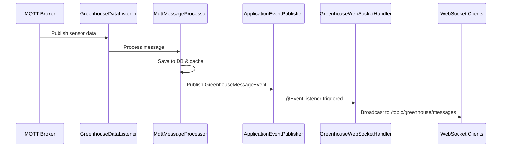

## Overview

The Invernaderos API uses **STOMP over WebSocket** to broadcast real-time sensor data to connected web and mobile clients. This enables live dashboard updates without polling.

<Note>
  **Protocol**: STOMP (Simple Text Oriented Messaging Protocol) over WebSocket
  
  **Fallback**: SockJS for browsers without native WebSocket support
  
  **Message Broker**: Simple in-memory broker (production-ready for moderate load)
</Note>

---

## Configuration

### WebSocket Endpoints

The system exposes two WebSocket endpoints:

```kotlin WebSocketConfig.kt
@Configuration
@EnableWebSocketMessageBroker
class WebSocketConfig : WebSocketMessageBrokerConfigurer {

    private val logger = LoggerFactory.getLogger(WebSocketConfig::class.java)

    /**
     * Configure the message broker
     *
     * - /topic: prefix for topics (one-to-many broadcast)
     * - /app: prefix for messages directed to the application
     * - /user: prefix for user-specific messages
     */
    override fun configureMessageBroker(registry: MessageBrokerRegistry) {
        logger.info("Configuring Message Broker for WebSocket")

        // Enable simple in-memory broker
        registry.enableSimpleBroker("/topic", "/queue")

        // Prefix for messages to @MessageMapping methods
        registry.setApplicationDestinationPrefixes("/app")

        // Prefix for sending messages to specific users
        registry.setUserDestinationPrefix("/user")
    }

    /**
     * Register STOMP endpoints
     *
     * - Main endpoint: /ws/greenhouse
     * - SockJS enabled for browser compatibility
     * - CORS allowed from any origin (adjust in production)
     */
    override fun registerStompEndpoints(registry: StompEndpointRegistry) {
        logger.info("Registering STOMP endpoints")

        // Endpoint with SockJS fallback
        registry.addEndpoint("/ws/greenhouse")
            .setAllowedOriginPatterns("*")  // ⚠️ Configure for production
            .withSockJS()

        // Native WebSocket endpoint (no SockJS)
        registry.addEndpoint("/ws/greenhouse-native")
            .setAllowedOriginPatterns("*")

        logger.info("WebSocket endpoints registered:")
        logger.info("  - ws://host/ws/greenhouse (with SockJS)")
        logger.info("  - ws://host/ws/greenhouse-native (native)")
        logger.info("Topics available:")
        logger.info("  - /topic/greenhouse/messages")
        logger.info("  - /topic/greenhouse/statistics")
    }
}
```
<Caption>Source: `WebSocketConfig.kt:35-86`</Caption>

<Warning>
  **CORS Configuration**: The current configuration allows connections from any origin (`*`). In production, restrict this to your frontend domains:
  
  ```kotlin
  .setAllowedOriginPatterns("https://app.invernaderos.com", "https://dashboard.invernaderos.com")
  ```
</Warning>

---

## Subscription Topics

Clients can subscribe to the following STOMP topics:

<Tabs>
  <Tab title="/topic/greenhouse/messages">
    ```
    Topic: /topic/greenhouse/messages
    Purpose: Real-time sensor data broadcasts
    Message Format: RealDataDto (JSON with 22 fields)
    Update Frequency: Every 5 seconds (or on MQTT message)
    
    Sample Message:
    {
      "timestamp": "2025-11-16T10:30:00Z",
      "TEMPERATURA INVERNADERO 01": 24.5,
      "HUMEDAD INVERNADERO 01": 62.3,
      "INVERNADERO_01_SECTOR_01": 1,
      "INVERNADERO_01_EXTRACTOR": 0,
      "greenhouseId": "SARA"
    }
    ```
    
    **Use Case**: Live dashboard displays, real-time charts, alerts
  </Tab>
  
  <Tab title="/topic/greenhouse/statistics">
    ```
    Topic: /topic/greenhouse/statistics
    Purpose: Aggregated statistics updates
    Message Format: Custom statistics DTO
    Update Frequency: Every 1 minute (configurable)
    
    Sample Message:
    {
      "totalMessages": 1000,
      "averageTemperature": 24.2,
      "averageHumidity": 62.5,
      "sensorsOnline": 22,
      "timestamp": "2025-11-16T10:30:00Z"
    }
    ```
    
    **Use Case**: Dashboard summary cards, system health indicators
  </Tab>
  
  <Tab title="/user/queue/alerts">
    ```
    Topic: /user/{username}/queue/alerts
    Purpose: User-specific alert notifications
    Message Format: Alert DTO
    Update Frequency: On alert trigger
    
    Sample Message:
    {
      "alertId": 123,
      "severity": "HIGH",
      "type": "THRESHOLD_EXCEEDED",
      "message": "Temperature exceeded 30°C in Greenhouse 01",
      "timestamp": "2025-11-16T10:30:00Z",
      "greenhouseId": "SARA"
    }
    ```
    
    **Use Case**: Push notifications to specific users
  </Tab>
</Tabs>

---

## Event-Driven Architecture

### Message Flow

WebSocket broadcasting is decoupled from MQTT processing using Spring's event system:

<CodeGroup>


```kotlin Event Publishing
// MqttMessageProcessor publishes event after processing
publisher.publishEvent(
    GreenhouseMessageEvent(
        source = this, 
        message = messageDto  // RealDataDto
    )
)
```

```kotlin Event Listening
// GreenhouseWebSocketHandler listens for events
@EventListener
fun handleGreenhouseMessage(event: GreenhouseMessageEvent) {
    try {
        logger.debug("Event received, broadcasting via WebSocket: {}", event.message.timestamp)

        // Broadcast to all subscribers
        messagingTemplate.convertAndSend(
            "/topic/greenhouse/messages",
            event.message  // RealDataDto (22 fields)
        )

        logger.trace("Message broadcasted successfully via WebSocket")

    } catch (e: Exception) {
        logger.error("Error broadcasting message via WebSocket", e)
    }
}
```
</CodeGroup>
<Caption>Source: `GreenhouseWebSocketHandler.kt:39-55`</Caption>

<Accordion title="Why Event-Driven Architecture?">
  **Benefits**:
  - **Decoupling**: MQTT processing doesn't depend on WebSocket availability
  - **Non-blocking**: Event publishing is asynchronous (doesn't block MQTT thread)
  - **Scalability**: Multiple listeners can react to the same event
  - **Testability**: Easy to test components in isolation
  
  **Alternative (NOT used)**:
  ```kotlin
  // ❌ BAD: Direct coupling
  fun processGreenhouseData(payload: String) {
      // ... process data ...
      webSocketHandler.broadcast(data)  // Direct dependency
  }
  ```
</Accordion>

---

## Client Integration

### JavaScript Client (SockJS + STOMP.js)

Connect to WebSocket endpoint from browser:

<CodeGroup>
```html HTML Setup
<!DOCTYPE html>
<html>
<head>
    <script src="https://cdn.jsdelivr.net/npm/sockjs-client@1/dist/sockjs.min.js"></script>
    <script src="https://cdn.jsdelivr.net/npm/stompjs@2.3.3/lib/stomp.min.js"></script>
</head>
<body>
    <h1>Greenhouse Dashboard</h1>
    <div id="sensor-data"></div>
    <script src="app.js"></script>
</body>
</html>
```

```javascript JavaScript Client
// app.js - WebSocket client with auto-reconnect
let stompClient = null;
let reconnectAttempts = 0;
const MAX_RECONNECT_ATTEMPTS = 10;

function connect() {
    // SockJS connection (fallback for older browsers)
    const socket = new SockJS('http://localhost:8080/ws/greenhouse');
    stompClient = Stomp.over(socket);

    // Optional: Disable debug logging
    stompClient.debug = null;

    // Connect to STOMP broker
    stompClient.connect({}, 
        function onConnected(frame) {
            console.log('Connected: ' + frame);
            reconnectAttempts = 0;

            // Subscribe to greenhouse messages
            stompClient.subscribe('/topic/greenhouse/messages', 
                function(message) {
                    const data = JSON.parse(message.body);
                    displaySensorData(data);
                }
            );

            // Subscribe to statistics
            stompClient.subscribe('/topic/greenhouse/statistics', 
                function(message) {
                    const stats = JSON.parse(message.body);
                    updateStatistics(stats);
                }
            );
        },
        function onError(error) {
            console.error('WebSocket error: ', error);
            // Auto-reconnect with exponential backoff
            if (reconnectAttempts < MAX_RECONNECT_ATTEMPTS) {
                const delay = Math.min(1000 * Math.pow(2, reconnectAttempts), 30000);
                console.log(`Reconnecting in ${delay}ms...`);
                setTimeout(connect, delay);
                reconnectAttempts++;
            }
        }
    );
}

function disconnect() {
    if (stompClient !== null) {
        stompClient.disconnect();
        console.log('Disconnected');
    }
}

function displaySensorData(data) {
    const container = document.getElementById('sensor-data');
    container.innerHTML = `
        <div class="sensor-card">
            <h3>Greenhouse: ${data.greenhouseId}</h3>
            <p>Temperature: ${data['TEMPERATURA INVERNADERO 01']}°C</p>
            <p>Humidity: ${data['HUMEDAD INVERNADERO 01']}%</p>
            <p>Timestamp: ${new Date(data.timestamp).toLocaleTimeString()}</p>
        </div>
    `;
}

function updateStatistics(stats) {
    console.log('Statistics updated:', stats);
    // Update dashboard summary cards
}

// Connect on page load
window.onload = connect;

// Disconnect on page unload
window.onbeforeunload = disconnect;
```

```typescript TypeScript Client (React)
// useWebSocket.ts - React hook for WebSocket connection
import { useEffect, useState, useRef } from 'react';
import SockJS from 'sockjs-client';
import { Client, IMessage } from '@stomp/stompjs';

interface SensorData {
  timestamp: string;
  'TEMPERATURA INVERNADERO 01': number;
  'HUMEDAD INVERNADERO 01': number;
  greenhouseId: string;
}

export function useWebSocket(url: string) {
  const [sensorData, setSensorData] = useState<SensorData | null>(null);
  const [connected, setConnected] = useState(false);
  const clientRef = useRef<Client | null>(null);

  useEffect(() => {
    const socket = new SockJS(url);
    const client = new Client({
      webSocketFactory: () => socket as any,
      
      onConnect: () => {
        console.log('WebSocket connected');
        setConnected(true);

        // Subscribe to sensor data
        client.subscribe('/topic/greenhouse/messages', (message: IMessage) => {
          const data = JSON.parse(message.body) as SensorData;
          setSensorData(data);
        });
      },

      onDisconnect: () => {
        console.log('WebSocket disconnected');
        setConnected(false);
      },

      onStompError: (frame) => {
        console.error('STOMP error:', frame);
      }
    });

    client.activate();
    clientRef.current = client;

    return () => {
      client.deactivate();
    };
  }, [url]);

  return { sensorData, connected };
}

// Usage in component
function Dashboard() {
  const { sensorData, connected } = useWebSocket('http://localhost:8080/ws/greenhouse');

  return (
    <div>
      <h1>Greenhouse Dashboard</h1>
      <p>Status: {connected ? '✅ Connected' : '❌ Disconnected'}</p>
      {sensorData && (
        <div>
          <p>Temperature: {sensorData['TEMPERATURA INVERNADERO 01']}°C</p>
          <p>Humidity: {sensorData['HUMEDAD INVERNADERO 01']}%</p>
        </div>
      )}
    </div>
  );
}
```
</CodeGroup>

### Kotlin Client (Spring WebSocket)

Connect from another Spring Boot application:

```kotlin
@Configuration
class WebSocketClientConfig {

    @Bean
    fun webSocketClient(): WebSocketStompClient {
        val client = WebSocketStompClient(StandardWebSocketClient())
        client.messageConverter = MappingJackson2MessageConverter()
        return client
    }

    @Bean
    fun connectToGreenhouseWebSocket(client: WebSocketStompClient): StompSession {
        val sessionHandler = object : StompSessionHandlerAdapter() {
            override fun afterConnected(
                session: StompSession,
                connectedHeaders: StompHeaders
            ) {
                println("Connected to Greenhouse WebSocket")
                
                // Subscribe to messages
                session.subscribe("/topic/greenhouse/messages", this)
            }

            override fun handleFrame(headers: StompHeaders, payload: Any?) {
                val data = payload as RealDataDto
                println("Received: ${data.timestamp} - Temp: ${data.temperaturaInvernadero01}")
            }
        }

        return client.connect("ws://localhost:8080/ws/greenhouse", sessionHandler).get()
    }
}
```

---

## Broadcasting Messages

### Programmatic Broadcasting

Send messages to topics from application code:

```kotlin GreenhouseWebSocketHandler.kt
@Component
class GreenhouseWebSocketHandler(
    private val messagingTemplate: SimpMessagingTemplate
) {

    /**
     * Send message to specific topic
     */
    fun sendMessage(destination: String, payload: Any) {
        try {
            messagingTemplate.convertAndSend(destination, payload)
            logger.debug("Message sent to {}", destination)
        } catch (e: Exception) {
            logger.error("Error sending message to {}", destination, e)
        }
    }

    /**
     * Send message to specific user
     */
    fun sendToUser(username: String, destination: String, payload: Any) {
        try {
            messagingTemplate.convertAndSendToUser(username, destination, payload)
            logger.debug("Message sent to user {} at {}", username, destination)
        } catch (e: Exception) {
            logger.error("Error sending message to user {}", username, e)
        }
    }

    /**
     * Broadcast statistics to all clients
     */
    fun broadcastStatistics(statistics: Any) {
        try {
            messagingTemplate.convertAndSend("/topic/greenhouse/statistics", statistics)
            logger.debug("Statistics broadcasted via WebSocket")
        } catch (e: Exception) {
            logger.error("Error broadcasting statistics via WebSocket", e)
        }
    }
}
```
<Caption>Source: `GreenhouseWebSocketHandler.kt:58-103`</Caption>

### User-Specific Messages

Send alerts to individual users:

```kotlin
@Service
class AlertService(
    private val webSocketHandler: GreenhouseWebSocketHandler
) {

    fun sendAlertToUser(username: String, alert: Alert) {
        webSocketHandler.sendToUser(
            username = username,
            destination = "/queue/alerts",
            payload = alert
        )
    }
}

// Client subscribes to:
// /user/{username}/queue/alerts
```

---

## Scaling Considerations

### In-Memory Broker Limitations

The current **simple in-memory broker** has limitations:

<Warning>
  **Limitations**:
  - Single-instance only (no horizontal scaling)
  - No message persistence (lost on restart)
  - All messages processed in same JVM
  
  **When to upgrade**: If you need multi-instance deployment or high availability.
</Warning>

### External Message Broker (RabbitMQ)

For production scale, use an external broker:

```yaml application.yaml
spring:
  rabbitmq:
    host: rabbitmq.invernaderos.com
    port: 5672
    username: ${RABBITMQ_USERNAME}
    password: ${RABBITMQ_PASSWORD}
```

```kotlin
@Configuration
@EnableWebSocketMessageBroker
class WebSocketConfig : WebSocketMessageBrokerConfigurer {

    override fun configureMessageBroker(registry: MessageBrokerRegistry) {
        // Use external RabbitMQ broker instead of simple in-memory
        registry.enableStompBrokerRelay("/topic", "/queue")
            .setRelayHost("rabbitmq.invernaderos.com")
            .setRelayPort(61613)  // STOMP port
            .setClientLogin("api-client")
            .setClientPasscode("password")
            .setSystemLogin("system")
            .setSystemPasscode("password")

        registry.setApplicationDestinationPrefixes("/app")
    }
}
```

**Benefits of RabbitMQ**:
- Multiple API instances can share broker
- Message persistence and durability
- Higher throughput and scalability
- Advanced routing and filtering

---

## Testing WebSocket Connections

### Browser DevTools

Test WebSocket connection in browser console:

```javascript
// Open browser console (F12) and run:
const socket = new SockJS('http://localhost:8080/ws/greenhouse');
const client = Stomp.over(socket);

client.connect({}, function() {
    console.log('Connected!');
    
    client.subscribe('/topic/greenhouse/messages', function(message) {
        console.log('Received:', JSON.parse(message.body));
    });
});
```

### wscat (Command-Line Tool)

Test native WebSocket endpoint:

```bash
# Install wscat
npm install -g wscat

# Connect to native WebSocket endpoint
wscat -c ws://localhost:8080/ws/greenhouse-native

# Send STOMP CONNECT frame
CONNECT
accept-version:1.1,1.0
heart-beat:10000,10000

# Send SUBSCRIBE frame
SUBSCRIBE
id:sub-0
destination:/topic/greenhouse/messages

# You should start receiving messages
```

### Integration Test

```kotlin
@SpringBootTest(webEnvironment = SpringBootTest.WebEnvironment.RANDOM_PORT)
class WebSocketIntegrationTest {

    @LocalServerPort
    private var port: Int = 0

    private lateinit var stompClient: WebSocketStompClient
    private lateinit var session: StompSession

    @BeforeEach
    fun setup() {
        stompClient = WebSocketStompClient(StandardWebSocketClient())
        stompClient.messageConverter = MappingJackson2MessageConverter()
    }

    @Test
    fun `should receive greenhouse messages via WebSocket`() {
        // Given
        val completableFuture = CompletableFuture<RealDataDto>()
        val url = "ws://localhost:$port/ws/greenhouse"

        // Connect and subscribe
        val sessionHandler = object : StompSessionHandlerAdapter() {
            override fun afterConnected(session: StompSession, connectedHeaders: StompHeaders) {
                session.subscribe("/topic/greenhouse/messages", object : StompFrameHandler {
                    override fun getPayloadType(headers: StompHeaders): Type {
                        return RealDataDto::class.java
                    }

                    override fun handleFrame(headers: StompHeaders, payload: Any?) {
                        completableFuture.complete(payload as RealDataDto)
                    }
                })
            }
        }

        session = stompClient.connect(url, sessionHandler).get(5, TimeUnit.SECONDS)

        // When - trigger MQTT message that broadcasts to WebSocket
        mqttPublisher.publish("GREENHOUSE/SARA", testPayload)

        // Then - receive message via WebSocket
        val receivedData = completableFuture.get(5, TimeUnit.SECONDS)
        assertThat(receivedData.greenhouseId).isEqualTo("SARA")
        assertThat(receivedData.temperaturaInvernadero01).isNotNull()
    }
}
```

---

## Best Practices

1. **Use SockJS fallback** for browser compatibility
2. **Implement auto-reconnect** with exponential backoff
3. **Restrict CORS origins** in production
4. **Use user-specific topics** for private notifications
5. **Monitor connection count** to prevent resource exhaustion
6. **Consider external broker** (RabbitMQ) for multi-instance deployments
7. **Handle disconnections gracefully** in client code
8. **Compress messages** for mobile clients (low bandwidth)

<Note>
  For MQTT message ingestion, see [MQTT Integration](/concepts/mqtt-integration).
  
  For multi-tenant data filtering, see [Multi-Tenant Architecture](/concepts/multi-tenant).
</Note>
