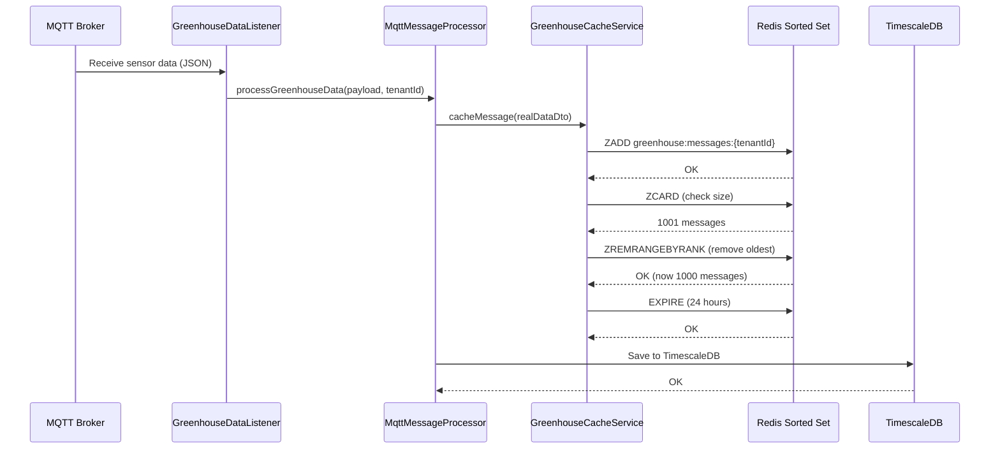

# Redis Caching Strategy

The Invernaderos API implements a **cache-aside pattern** using Redis Sorted Sets for real-time sensor data caching.

## Overview

<CardGroup cols={2}>
  <Card title="Data Structure" icon="layer-group">
    Redis Sorted Set (ZSET)
    
    Timestamp-ordered messages
  </Card>
  <Card title="Capacity" icon="database">
    Last **1000 messages** per tenant
    
    24-hour TTL
  </Card>
</CardGroup>

---

## Architecture

### Why Redis Sorted Sets?

Redis Sorted Sets provide **O(log N)** time complexity for range queries, making them ideal for time-series data.

```
Key: "greenhouse:messages:{tenantId}"
Type: Sorted Set (ZSET)
Score: Timestamp (epoch milliseconds)
Value: JSON-serialized sensor data

Example:
┌─────────────────┬──────────────────────────────────────┐
│ Score           │ Value (JSON)                         │
├─────────────────┼──────────────────────────────────────┤
│ 1709827200000   │ {"temp":25.5,"humidity":65,...}     │
│ 1709827205000   │ {"temp":25.6,"humidity":64,...}     │
│ 1709827210000   │ {"temp":25.4,"humidity":66,...}     │
└─────────────────┴──────────────────────────────────────┘
         ↑
   Sorted by timestamp (DESC)
```

### Multi-Tenant Isolation

<Note>
Each tenant has its own isolated cache key to prevent cross-tenant data leakage.
</Note>

```kotlin
private fun getMessagesKey(tenantId: String?): String {
    val safeTenantId = tenantId?.takeIf { it.isNotBlank() } ?: "DEFAULT"
    return "greenhouse:messages:$safeTenantId"
}

// Examples:
// tenant "SARA"    → "greenhouse:messages:SARA"
// tenant "001"     → "greenhouse:messages:001"
// legacy (null)    → "greenhouse:messages:DEFAULT"
```

---

## Implementation

### GreenhouseCacheService.kt

The `GreenhouseCacheService` class implements all Redis operations with proper error handling and logging.

<Expandable title="Complete implementation (221 lines)">

```kotlin
package com.apptolast.invernaderos.features.greenhouse

import com.fasterxml.jackson.module.kotlin.jacksonObjectMapper
import java.time.Instant
import java.util.concurrent.TimeUnit
import org.slf4j.LoggerFactory
import org.springframework.data.redis.core.RedisTemplate
import org.springframework.stereotype.Service

/**
 * Service for managing GREENHOUSE message cache in Redis.
 *
 * Uses Redis Sorted Set to store messages ordered by timestamp for efficient
 * time-based queries.
 *
 * MULTI-TENANT ISOLATION:
 * - Each tenant has its own cache key: "greenhouse:messages:{tenantId}"
 * - Prevents cross-tenant data access
 * - Required after PostgreSQL multi-tenant migration (V3-V10)
 *
 * Redis Structure:
 * - Key: "greenhouse:messages:{tenantId}"
 * - Type: Sorted Set (ZSET)
 * - Score: timestamp in epoch millis
 * - Value: JSON serialized RealDataDto
 */
@Service
class GreenhouseCacheService(private val redisTemplate: RedisTemplate<String, String>) {

    private val logger = LoggerFactory.getLogger(GreenhouseCacheService::class.java)
    private val objectMapper = jacksonObjectMapper()

    companion object {
        private const val MESSAGES_KEY_PREFIX = "greenhouse:messages"
        private const val MAX_CACHED_MESSAGES = 1000L
        private const val TTL_HOURS = 24L
        private const val DEFAULT_TENANT_ID = "DEFAULT"

        /**
         * Generates the cache key specific for a tenant.
         * Format: "greenhouse:messages:{tenantId}"
         *
         * @param tenantId Tenant ID (uses DEFAULT for legacy data)
         * @return Tenant-isolated cache key
         */
        private fun getMessagesKey(tenantId: String?): String {
            val safeTenantId = tenantId?.takeIf { it.isNotBlank() } ?: DEFAULT_TENANT_ID
            return "$MESSAGES_KEY_PREFIX:$safeTenantId"
        }
    }

    /**
     * Caches a message in Redis with tenant isolation.
     *
     * @param message The message to cache (must include tenantId)
     */
    fun cacheMessage(message: RealDataDto) {
        try {
            val tenantId = message.tenantId
            val messagesKey = getMessagesKey(tenantId)
            val score = message.timestamp.toEpochMilli().toDouble()
            val jsonValue = message.toJson()

            // Add message to tenant's sorted set
            redisTemplate.opsForZSet().add(messagesKey, jsonValue, score)

            // Keep only last MAX_CACHED_MESSAGES per tenant
            val currentSize = redisTemplate.opsForZSet().size(messagesKey) ?: 0
            if (currentSize > MAX_CACHED_MESSAGES) {
                // Remove oldest messages
                val toRemove = currentSize - MAX_CACHED_MESSAGES
                redisTemplate.opsForZSet().removeRange(messagesKey, 0, toRemove - 1)
            }

            // Set 24-hour TTL (renewed with each write)
            redisTemplate.expire(messagesKey, TTL_HOURS, TimeUnit.HOURS)

            logger.debug(
                "Message cached in Redis for tenant=$tenantId: timestamp=${message.timestamp}"
            )
        } catch (e: Exception) {
            logger.error("Error caching message in Redis for tenant=${message.tenantId}", e)
        }
    }

    /**
     * Gets the last N messages from cache for a specific tenant.
     *
     * @param tenantId Tenant ID (null = DEFAULT tenant for backward compatibility)
     * @param limit Number of messages to retrieve (default 100)
     * @return List of messages ordered by timestamp DESC (most recent first)
     */
    fun getRecentMessages(tenantId: String? = null, limit: Int = 100): List<RealDataDto> {
        return try {
            val messagesKey = getMessagesKey(tenantId)

            // Get last 'limit' messages from tenant's sorted set
            // -limit to -1 means last 'limit' elements
            val messages =
                redisTemplate.opsForZSet().reverseRange(messagesKey, 0, limit.toLong() - 1)

            messages?.mapNotNull { json ->
                try {
                    objectMapper.readValue(json, RealDataDto::class.java)
                } catch (e: Exception) {
                    logger.error("Error deserializing message from Redis: $json", e)
                    null
                }
            } ?: emptyList()
        } catch (e: Exception) {
            logger.error("Error getting recent messages from Redis for tenant=$tenantId", e)
            emptyList()
        }
    }

    /**
     * Gets messages in a specific time range for a tenant.
     *
     * @param tenantId Tenant ID (null = DEFAULT tenant for backward compatibility)
     * @param startTime Start timestamp
     * @param endTime End timestamp
     * @return List of messages in the specified range
     */
    fun getMessagesByTimeRange(
        tenantId: String? = null,
        startTime: Instant,
        endTime: Instant
    ): List<RealDataDto> {
        return try {
            val messagesKey = getMessagesKey(tenantId)
            val minScore = startTime.toEpochMilli().toDouble()
            val maxScore = endTime.toEpochMilli().toDouble()

            val messages =
                redisTemplate.opsForZSet().reverseRangeByScore(messagesKey, minScore, maxScore)

            messages?.mapNotNull { json ->
                try {
                    objectMapper.readValue(json, RealDataDto::class.java)
                } catch (e: Exception) {
                    logger.error("Error deserializing message from Redis: $json", e)
                    null
                }
            } ?: emptyList()
        } catch (e: Exception) {
            logger.error(
                "Error getting messages by time range from Redis for tenant=$tenantId",
                e
            )
            emptyList()
        }
    }

    /**
     * Gets the most recent message from cache for a tenant.
     *
     * @param tenantId Tenant ID (null = DEFAULT tenant for backward compatibility)
     * @return The most recent message or null if no messages
     */
    fun getLatestMessage(tenantId: String? = null): RealDataDto? {
        return try {
            val messagesKey = getMessagesKey(tenantId)
            val messages = redisTemplate.opsForZSet().reverseRange(messagesKey, 0, 0)

            messages?.firstOrNull()?.let { json ->
                try {
                    objectMapper.readValue(json, RealDataDto::class.java)
                } catch (e: Exception) {
                    logger.error("Error deserializing message from Redis: $json", e)
                    null
                }
            }
        } catch (e: Exception) {
            logger.error("Error getting latest message from Redis for tenant=$tenantId", e)
            null
        }
    }

    /**
     * Counts the total number of messages in cache for a tenant.
     *
     * @param tenantId Tenant ID (null = DEFAULT tenant for backward compatibility)
     * @return Number of cached messages
     */
    fun countMessages(tenantId: String? = null): Long {
        return try {
            val messagesKey = getMessagesKey(tenantId)
            redisTemplate.opsForZSet().size(messagesKey) ?: 0L
        } catch (e: Exception) {
            logger.error("Error counting messages in Redis for tenant=$tenantId", e)
            0L
        }
    }

    /**
     * Clears all messages from cache for a specific tenant.
     *
     * @param tenantId Tenant ID (null = DEFAULT tenant).
     *                 To clear ALL tenants' caches, use clearAllTenantsCache() instead.
     */
    fun clearCache(tenantId: String? = null) {
        try {
            val messagesKey = getMessagesKey(tenantId)
            redisTemplate.delete(messagesKey)
            logger.info("GREENHOUSE message cache cleared for tenant=$tenantId")
        } catch (e: Exception) {
            logger.error("Error clearing Redis cache for tenant=$tenantId", e)
        }
    }

    /** Gets cache statistics for a tenant */
    fun getCacheStats(tenantId: String? = null): Map<String, Any> {
        val count = countMessages(tenantId)
        return mapOf("count" to count, "tenantId" to (tenantId ?: "DEFAULT"))
    }
}
```

</Expandable>

---

## Redis Operations

### Cache Operations with Time Complexity

<ParamField path="ZADD" type="O(log N)">
  Add message to sorted set
  
  ```kotlin
  redisTemplate.opsForZSet().add(key, jsonValue, score)
  ```
</ParamField>

<ParamField path="ZREVRANGE" type="O(log N + M)">
  Get last N messages (M = result size)
  
  ```kotlin
  redisTemplate.opsForZSet().reverseRange(key, 0, limit - 1)
  ```
</ParamField>

<ParamField path="ZREVRANGEBYSCORE" type="O(log N + M)">
  Get messages by time range
  
  ```kotlin
  redisTemplate.opsForZSet().reverseRangeByScore(key, minScore, maxScore)
  ```
</ParamField>

<ParamField path="ZREMRANGEBYRANK" type="O(log N + M)">
  Remove oldest messages when exceeding limit
  
  ```kotlin
  redisTemplate.opsForZSet().removeRange(key, 0, toRemove - 1)
  ```
</ParamField>

<ParamField path="ZCARD" type="O(1)">
  Count total messages
  
  ```kotlin
  redisTemplate.opsForZSet().size(key)
  ```
</ParamField>

<ParamField path="DEL" type="O(1)">
  Delete entire cache key
  
  ```kotlin
  redisTemplate.delete(key)
  ```
</ParamField>

<ParamField path="EXPIRE" type="O(1)">
  Set 24-hour TTL (renewed on each write)
  
  ```kotlin
  redisTemplate.expire(key, 24, TimeUnit.HOURS)
  ```
</ParamField>

### Performance Characteristics

<CardGroup cols={3}>
  <Card title="Write Speed" icon="gauge-high">
    **O(log N)** insert
    
    ~10,000 writes/sec
  </Card>
  
  <Card title="Read Speed" icon="bolt">
    **O(log N + M)** query
    
    Less than 1ms for 100 messages
  </Card>
  
  <Card title="Memory" icon="memory">
    **~500 bytes** per message
    
    500KB per tenant (1000 msgs)
  </Card>
</CardGroup>

---

## Cache Workflow

### Message Flow



### Cache Eviction Strategy

<Steps>
  <Step title="New message arrives">
    MQTT listener receives sensor data and parses to `RealDataDto`
  </Step>
  
  <Step title="Add to Redis">
    `ZADD` with timestamp as score (epoch milliseconds)
  </Step>
  
  <Step title="Check size">
    `ZCARD` to count current messages
  </Step>
  
  <Step title="Evict if needed">
    If > 1000 messages, `ZREMRANGEBYRANK` removes oldest
  </Step>
  
  <Step title="Renew TTL">
    `EXPIRE` resets 24-hour TTL on the key
  </Step>
</Steps>

<Note>
The cache is **self-cleaning**. Old messages are automatically removed both by the 1000-message limit and 24-hour TTL.
</Note>

---

## Redis Configuration

### Application Configuration

```yaml application.yaml
spring:
  data:
    redis:
      host: ${REDIS_HOST:138.199.157.58}     # K8s node IP (default)
      port: ${REDIS_PORT:30379}               # NodePort (DEV: 6379)
      password: ${REDIS_PASSWORD}             # From K8s Secret
      database: 0
      timeout: 60000ms                        # 60 seconds
      connect-timeout: 10000ms                # 10 seconds
      client-type: lettuce                    # Lettuce client (async, reactive)

      lettuce:
        pool:
          max-active: 100                     # Max connections
          max-idle: 50                        # Max idle connections
          min-idle: 10                        # Min idle connections
          max-wait: 3000ms                    # Max wait for connection
        shutdown-timeout: 2000ms

  cache:
    type: redis
    redis:
      time-to-live: 600000                    # 10 minutes (600000 ms)
      cache-null-values: false
      key-prefix: "ts-app::"                 # Prefix for @Cacheable keys
      use-key-prefix: true
```

### Kubernetes Deployment

<Accordion title="Redis StatefulSet configuration">

```yaml statefulset.yaml
apiVersion: apps/v1
kind: StatefulSet
metadata:
  name: redis
  namespace: apptolast-invernadero-api
spec:
  serviceName: redis
  replicas: 1
  template:
    spec:
      containers:
      - name: redis
        image: redis:7-alpine
        command: ["redis-server", "/etc/redis/redis.conf"]
        ports:
        - containerPort: 6379
        resources:
          requests:
            cpu: 250m
            memory: 512Mi
          limits:
            cpu: 500m
            memory: 1Gi
        volumeMounts:
        - name: data
          mountPath: /data
        - name: config
          mountPath: /etc/redis
  volumeClaimTemplates:
  - metadata:
      name: data
    spec:
      accessModes: ["ReadWriteOnce"]
      resources:
        requests:
          storage: 10Gi
```

```conf redis.conf
# Memory Management
maxmemory 900mb
maxmemory-policy volatile-lru     # Evict keys with TTL using LRU

# Persistence
save 300 10                       # Save every 5 min if 10+ changes
save 60 10000                     # Save every 1 min if 10000+ changes
rdbcompression yes
rdbchecksum yes
dbfilename dump.rdb
dir /data

# Performance
timeout 300                       # Close idle clients after 5 minutes
tcp-keepalive 60
maxclients 10000

# Security
requirepass ${REDIS_PASSWORD}
protected-mode yes
rename-command FLUSHDB ""         # Disabled for safety
rename-command FLUSHALL ""        # Disabled for safety
rename-command CONFIG ""          # Disabled for safety

# Logging
loglevel notice
logfile ""
```

</Accordion>

### Connection Pooling (Lettuce)

<CardGroup cols={2}>
  <Card title="Max Active" icon="users">
    **100 connections**
    
    Handles 100 concurrent requests
  </Card>
  
  <Card title="Min Idle" icon="circle-pause">
    **10 connections**
    
    Pre-warmed for instant response
  </Card>
  
  <Card title="Max Idle" icon="circle">
    **50 connections**
    
    Balance between performance and resources
  </Card>
  
  <Card title="Max Wait" icon="stopwatch">
    **3 seconds**
    
    Timeout for acquiring connection
  </Card>
</CardGroup>

<Note>
**Lettuce** is preferred over Jedis because:
- Asynchronous, non-blocking I/O with Netty
- Thread-safe (single connection shared)
- Reactive Streams support (Spring WebFlux)
- Auto-reconnect on failure
</Note>

---

## Usage Examples

### Caching Sensor Data

```kotlin
@Service
class MqttMessageProcessor(
    private val cacheService: GreenhouseCacheService,
    private val repository: ReadingRepository
) {
    
    @Transactional("timescaleTransactionManager")
    fun processGreenhouseData(payload: String, tenantId: String) {
        // 1. Parse JSON to DTO
        val message = payload.toRealDataDto(Instant.now(), tenantId)
        
        // 2. Cache in Redis (fast, non-blocking)
        cacheService.cacheMessage(message)
        
        // 3. Save to TimescaleDB (persistent)
        val readings = message.toReadings()
        repository.saveAll(readings)
        
        // 4. Publish to WebSocket clients
        eventPublisher.publishEvent(GreenhouseMessageEvent(this, message))
    }
}
```

### Retrieving Cached Data

<CodeGroup>

```kotlin Get Recent Messages
// Get last 100 messages for tenant "SARA"
val recentMessages = cacheService.getRecentMessages(
    tenantId = "SARA",
    limit = 100
)

recentMessages.forEach { message ->
    println("Temp: ${message.temperaturaInvernadero01}°C at ${message.timestamp}")
}
```

```kotlin Get by Time Range
// Get messages from last hour
val oneHourAgo = Instant.now().minus(1, ChronoUnit.HOURS)
val now = Instant.now()

val messages = cacheService.getMessagesByTimeRange(
    tenantId = "SARA",
    startTime = oneHourAgo,
    endTime = now
)

println("Found ${messages.size} messages in last hour")
```

```kotlin Get Latest Message
// Get most recent reading
val latestMessage = cacheService.getLatestMessage(tenantId = "SARA")

if (latestMessage != null) {
    println("Latest temp: ${latestMessage.temperaturaInvernadero01}°C")
    println("Timestamp: ${latestMessage.timestamp}")
} else {
    println("No cached messages")
}
```

```kotlin Cache Statistics
// Get cache info
val stats = cacheService.getCacheStats(tenantId = "SARA")
println("Tenant: ${stats["tenantId"]}")
println("Cached messages: ${stats["count"]}")

// Count messages
val count = cacheService.countMessages(tenantId = "SARA")
println("SARA has $count cached messages")
```

</CodeGroup>

### REST Endpoint Example

```kotlin
@RestController
@RequestMapping("/api/greenhouse")
class GreenhouseController(
    private val cacheService: GreenhouseCacheService
) {
    
    @GetMapping("/cache/recent")
    fun getRecentMessages(
        @RequestParam(required = false) tenantId: String?,
        @RequestParam(defaultValue = "100") limit: Int
    ): ResponseEntity<List<RealDataDto>> {
        val messages = cacheService.getRecentMessages(tenantId, limit)
        return ResponseEntity.ok(messages)
    }
    
    @GetMapping("/cache/latest")
    fun getLatestMessage(
        @RequestParam(required = false) tenantId: String?
    ): ResponseEntity<RealDataDto> {
        val message = cacheService.getLatestMessage(tenantId)
        return if (message != null) {
            ResponseEntity.ok(message)
        } else {
            ResponseEntity.notFound().build()
        }
    }
    
    @GetMapping("/cache/info")
    fun getCacheInfo(
        @RequestParam(required = false) tenantId: String?
    ): ResponseEntity<Map<String, Any>> {
        val stats = cacheService.getCacheStats(tenantId)
        return ResponseEntity.ok(stats)
    }
}
```

---

## Monitoring and Maintenance

### Health Check Endpoint

```bash
# Check cache connectivity
curl http://localhost:8080/api/greenhouse/cache/info

# Response:
{
  "totalMessages": 1000,
  "tenantId": "SARA",
  "cacheType": "Redis Sorted Set",
  "maxCapacity": 1000,
  "utilizationPercentage": 100.0
}
```

### Redis CLI Commands

<CodeGroup>

```bash Check Cache Size
# Connect to Redis
redis-cli -a "${REDIS_PASSWORD}"

# Count messages for tenant SARA
ZCARD greenhouse:messages:SARA
# Output: (integer) 1000

# Get oldest message timestamp
ZRANGE greenhouse:messages:SARA 0 0 WITHSCORES
# Output: 1) "{...json...}"
#         2) "1709827200000"

# Get newest message timestamp
ZREVRANGE greenhouse:messages:SARA 0 0 WITHSCORES
# Output: 1) "{...json...}"
#         2) "1709834400000"
```

```bash Memory Usage
# Get Redis memory stats
INFO memory

# Key metrics:
# used_memory_human: 45.23M
# used_memory_peak_human: 50.12M
# mem_fragmentation_ratio: 1.12
# evicted_keys: 0

# Check TTL for a key
TTL greenhouse:messages:SARA
# Output: (integer) 86340  (23h 59m remaining)
```

```bash View Cached Messages
# Get last 5 messages (newest first)
ZREVRANGE greenhouse:messages:SARA 0 4

# Get messages in time range
ZREVRANGEBYSCORE greenhouse:messages:SARA 1709834400000 1709827200000

# Count messages in time range
ZCOUNT greenhouse:messages:SARA 1709827200000 1709834400000
```

```bash Monitoring
# Monitor real-time Redis commands
MONITOR

# Watch cache operations
# Output:
# 1709834401.123456 [0] "ZADD" "greenhouse:messages:SARA" "1709834401000" "{...}"
# 1709834401.234567 [0] "ZREMRANGEBYRANK" "greenhouse:messages:SARA" "0" "0"
# 1709834401.345678 [0] "EXPIRE" "greenhouse:messages:SARA" "86400"
```

</CodeGroup>

### Performance Tuning

<CardGroup cols={2}>
  <Card title="Eviction Policy" icon="trash">
    **volatile-lru**
    
    Evicts least recently used keys with TTL
  </Card>
  
  <Card title="Persistence" icon="floppy-disk">
    **RDB Snapshots**
    
    Every 5 min (10+ changes) or 1 min (10k+ changes)
  </Card>
  
  <Card title="Compression" icon="compress">
    **RDB Compression: ON**
    
    Reduces disk usage by ~70%
  </Card>
  
  <Card title="Connection Pool" icon="network-wired">
    **100 max connections**
    
    Supports 100 concurrent API requests
  </Card>
</CardGroup>

<Warning>
**Memory Limit:** Redis is configured with `maxmemory 900mb`. If exceeded, keys with TTL are evicted using LRU algorithm.

**Current Usage:** ~500KB per tenant (1000 messages × 500 bytes)
</Warning>

---

## Troubleshooting

<AccordionGroup>
  <Accordion title="Cache not updating">
    **Symptoms:** New sensor data not appearing in cache
    
    **Possible Causes:**
    1. Redis connection timeout
    2. Wrong tenant ID
    3. Redis memory full (eviction)
    
    **Solutions:**
    ```bash
    # Check Redis connectivity
    redis-cli -a "${REDIS_PASSWORD}" PING
    
    # Check memory usage
    redis-cli -a "${REDIS_PASSWORD}" INFO memory
    
    # Check cache key exists
    redis-cli -a "${REDIS_PASSWORD}" EXISTS greenhouse:messages:SARA
    
    # View application logs
    kubectl logs -f deployment/invernaderos-api-prod | grep "Cache"
    ```
  </Accordion>
  
  <Accordion title="High memory usage">
    **Symptoms:** Redis using >900MB memory
    
    **Possible Causes:**
    1. Too many tenants with 1000 messages each
    2. Large JSON payloads
    3. Memory fragmentation
    
    **Solutions:**
    ```bash
    # Check number of keys
    redis-cli -a "${REDIS_PASSWORD}" DBSIZE
    
    # Get memory usage per key type
    redis-cli -a "${REDIS_PASSWORD}" --bigkeys
    
    # Check fragmentation ratio
    redis-cli -a "${REDIS_PASSWORD}" INFO memory | grep fragmentation
    
    # If fragmentation > 1.5, restart Redis
    kubectl rollout restart statefulset/redis -n apptolast-invernadero-api
    ```
  </Accordion>
  
  <Accordion title="Slow cache queries">
    **Symptoms:** API response time >500ms for cache queries
    
    **Possible Causes:**
    1. Large result sets (requesting 1000+ messages)
    2. Redis CPU bottleneck
    3. Network latency
    
    **Solutions:**
    ```bash
    # Check Redis CPU usage
    kubectl top pod -n apptolast-invernadero-api -l app=redis
    
    # Monitor slow queries (>10ms)
    redis-cli -a "${REDIS_PASSWORD}" SLOWLOG GET 10
    
    # Reduce query limit
    # Instead of: getRecentMessages(tenantId, 1000)
    # Use:        getRecentMessages(tenantId, 100)
    ```
  </Accordion>
</AccordionGroup>

---

## Related Documentation

<CardGroup cols={3}>
  <Card title="Database Architecture" icon="database" href="/data/databases">
    TimescaleDB and PostgreSQL setup
  </Card>
  
  <Card title="Migrations" icon="code-branch" href="/data/migrations">
    Flyway migration history
  </Card>
  
  <Card title="API Reference" icon="code" href="/api-reference/introduction">
    Cache endpoints documentation
  </Card>
</CardGroup>
