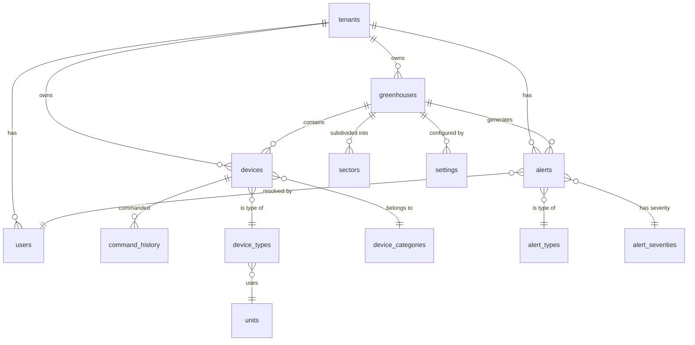

# Database Architecture

The Invernaderos API implements a **dual database strategy** optimized for IoT time-series data and metadata management.

## Overview

<CardGroup cols={2}>
  <Card title="TimescaleDB" icon="clock" color="#FDB515">
    Time-series sensor readings
    
    Port: **30432**
  </Card>
  <Card title="PostgreSQL" icon="table" color="#336791">
    Metadata and reference data
    
    Port: **30433**
  </Card>
</CardGroup>

## Database Strategy

### Why Two Databases?

The system separates **hot time-series data** from **cold reference data** for optimal performance:

- **TimescaleDB**: Optimized for high-frequency sensor writes (1000s/sec) with automatic compression
- **PostgreSQL**: Traditional ACID database for business entities with complex relationships

<Note>
Both databases run PostgreSQL 16 under the hood. TimescaleDB is a PostgreSQL extension that adds time-series superpowers.
</Note>

---

## TimescaleDB (Time-Series)

**Connection Details:**

<ParamField path="host" type="string" default="localhost">
  Database host
</ParamField>

<ParamField path="port" type="number" default="30432">
  TimescaleDB port (NodePort)
</ParamField>

<ParamField path="database" type="string" default="greenhouse_timeseries_prod">
  Database name
</ParamField>

<ParamField path="schema" type="string" default="iot">
  Primary schema for sensor data
</ParamField>

### Schema Structure

```
iot/
├── readings                    -- Simplified sensor readings (BIGINT device IDs)
├── sensor_readings             -- Legacy format (VARCHAR sensor IDs)
├── sensor_readings_hourly      -- Pre-aggregated hourly stats
├── sensor_readings_daily       -- Daily aggregations
└── sensor_readings_monthly     -- Monthly aggregations

staging/
├── sensor_readings_raw         -- Bulk import staging area
├── sensor_readings_validated   -- Validated staging data
├── bulk_import_log             -- Import audit trail
└── validation_rules            -- Configurable validation thresholds
```

### Core Table: `iot.readings`

<Expandable title="readings table schema (current design)">

```sql
CREATE TABLE iot.readings (
    time        TIMESTAMPTZ NOT NULL,
    device_id   BIGINT NOT NULL,
    value       DOUBLE PRECISION NOT NULL,
    metadata    JSONB DEFAULT '{}',
    
    PRIMARY KEY (time, device_id)
);

-- Convert to hypertable (TimescaleDB)
SELECT create_hypertable('iot.readings', 'time', 
    chunk_time_interval => INTERVAL '7 days');

-- Enable compression (after 7 days)
ALTER TABLE iot.readings SET (
    timescaledb.compress,
    timescaledb.compress_segmentby = 'device_id',
    timescaledb.compress_orderby = 'time DESC'
);

-- Retention policy (keep 2 years)
SELECT add_retention_policy('iot.readings', INTERVAL '2 years');
```

**Kotlin Entity:**

```kotlin
@Entity
@Table(name = "readings", schema = "iot")
@IdClass(ReadingId::class)
data class Reading(
    @Id
    @Column(name = "time", nullable = false)
    val time: Instant,

    @Id
    @Column(name = "device_id", nullable = false)
    val deviceId: Long,

    @Column(name = "value", nullable = false)
    val value: Double,

    @Column(name = "metadata", columnDefinition = "jsonb")
    val metadata: String? = "{}"
)
```

**Composite Primary Key:**

```kotlin
data class ReadingId(
    val time: Instant = Instant.now(),
    val deviceId: Long = 0L
) : Serializable
```

</Expandable>

### Continuous Aggregates

TimescaleDB automatically pre-computes hourly statistics for faster dashboard queries.

<Expandable title="sensor_readings_hourly view">

```sql
CREATE MATERIALIZED VIEW iot.sensor_readings_hourly
WITH (timescaledb.continuous) AS
SELECT
    time_bucket('1 hour', time) AS time,
    greenhouse_id,
    tenant_id,
    sensor_type,
    AVG(value) AS avg_value,
    MIN(value) AS min_value,
    MAX(value) AS max_value,
    STDDEV(value) AS stddev_value,
    COUNT(*) AS count_readings,
    MIN(time) AS first_reading_at,
    MAX(time) AS last_reading_at
FROM iot.sensor_readings
GROUP BY time_bucket('1 hour', time), greenhouse_id, tenant_id, sensor_type;

-- Refresh policy (every 1 hour)
SELECT add_continuous_aggregate_policy('iot.sensor_readings_hourly',
    start_offset => INTERVAL '3 hours',
    end_offset => INTERVAL '1 hour',
    schedule_interval => INTERVAL '1 hour');
```

**Performance Benefits:**
- **60x faster** than querying raw data for hourly charts
- Dashboard loads in less than 100ms instead of 6 seconds
- Automatically updated in background

</Expandable>

---

## PostgreSQL (Metadata)

**Connection Details:**

<ParamField path="host" type="string" default="localhost">
  Database host
</ParamField>

<ParamField path="port" type="number" default="30433">
  PostgreSQL port (NodePort)
</ParamField>

<ParamField path="database" type="string" default="postgres">
  Database name
</ParamField>

<ParamField path="schema" type="string" default="metadata">
  Primary schema for business entities
</ParamField>

### Schema Structure

```
metadata/
├── tenants                 -- Multi-tenant root table
├── users                   -- User accounts
├── greenhouses             -- Greenhouse facilities
├── sectors                 -- Greenhouse subdivisions
├── devices                 -- IoT devices (sensors + actuators)
├── alerts                  -- Alert history
├── settings                -- Greenhouse settings
├── command_history         -- Device command audit log
│
├── units                   -- Measurement units catalog (°C, %, hPa)
├── device_types            -- Device type catalog (TEMPERATURE, HUMIDITY)
├── actuator_states         -- Actuator states (ON, OFF, AUTO, ERROR)
├── alert_types             -- Alert types (THRESHOLD, SENSOR_OFFLINE)
├── alert_severities        -- Severity levels (INFO, WARNING, CRITICAL)
├── data_types              -- Data type validation rules
├── periods                 -- Time periods (DAY, NIGHT, ALL)
└── device_categories       -- Categories (SENSOR, ACTUATOR)
```

### Core Tables

<Expandable title="tenants table (multi-tenant root)">

```sql
CREATE TABLE metadata.tenants (
    id              BIGINT PRIMARY KEY DEFAULT nextval('tenants_id_seq'),
    name            VARCHAR(100) NOT NULL UNIQUE,
    
    -- Company details
    company_name    VARCHAR(200),
    legal_name      VARCHAR(200),
    tax_id          VARCHAR(50),
    
    -- Address
    address         TEXT,
    city            VARCHAR(100),
    country         VARCHAR(100),
    postal_code     VARCHAR(20),
    
    -- Contact
    phone           VARCHAR(30),
    email           VARCHAR(100),
    website         VARCHAR(255),
    
    -- Metadata
    industry        VARCHAR(100),
    is_active       BOOLEAN NOT NULL DEFAULT TRUE,
    
    -- Audit
    created_at      TIMESTAMPTZ NOT NULL DEFAULT NOW(),
    updated_at      TIMESTAMPTZ NOT NULL DEFAULT NOW()
);

CREATE INDEX idx_tenants_active ON metadata.tenants(is_active);
CREATE INDEX idx_tenants_name ON metadata.tenants(name);
```

</Expandable>

<Expandable title="greenhouses table">

```sql
CREATE TABLE metadata.greenhouses (
    id                      BIGINT PRIMARY KEY DEFAULT nextval('greenhouses_id_seq'),
    tenant_id               BIGINT NOT NULL REFERENCES tenants(id) ON DELETE CASCADE,
    
    -- Identification
    name                    VARCHAR(100) NOT NULL,
    greenhouse_code         VARCHAR(50) UNIQUE,
    description             TEXT,
    
    -- Location
    location_coordinates    GEOGRAPHY(POINT, 4326),
    timezone                VARCHAR(50) DEFAULT 'Europe/Madrid',
    
    -- Physical properties
    area_m2                 NUMERIC(10,2),
    greenhouse_type         VARCHAR(50),
    
    -- MQTT configuration
    mqtt_topic              VARCHAR(100),
    
    -- Status
    is_active               BOOLEAN NOT NULL DEFAULT TRUE,
    
    -- Audit
    created_at              TIMESTAMPTZ NOT NULL DEFAULT NOW(),
    updated_at              TIMESTAMPTZ NOT NULL DEFAULT NOW(),
    
    CONSTRAINT uq_greenhouse_tenant_name UNIQUE (tenant_id, name)
);

CREATE INDEX idx_greenhouses_tenant ON metadata.greenhouses(tenant_id);
CREATE INDEX idx_greenhouses_active ON metadata.greenhouses(is_active);
CREATE INDEX idx_greenhouses_tenant_active ON metadata.greenhouses(tenant_id, is_active);
```

</Expandable>

<Expandable title="devices table (unified sensors + actuators)">

```sql
CREATE TABLE metadata.devices (
    id              BIGINT PRIMARY KEY DEFAULT nextval('devices_id_seq'),
    tenant_id       BIGINT NOT NULL REFERENCES tenants(id) ON DELETE CASCADE,
    greenhouse_id   BIGINT NOT NULL REFERENCES greenhouses(id) ON DELETE CASCADE,
    
    -- Identification
    catalog_id      VARCHAR(100) NOT NULL,  -- Hardware ID (ESP32_TEMP_001)
    name            VARCHAR(100) NOT NULL,
    description     TEXT,
    
    -- Device type
    device_type_id  INTEGER NOT NULL REFERENCES device_types(id),
    category_id     SMALLINT NOT NULL REFERENCES device_categories(id),
    
    -- MQTT configuration
    mqtt_topic      VARCHAR(100),
    
    -- Status
    is_active       BOOLEAN NOT NULL DEFAULT TRUE,
    last_seen_at    TIMESTAMPTZ,
    
    -- Metadata
    metadata        JSONB,
    
    -- Audit
    created_at      TIMESTAMPTZ NOT NULL DEFAULT NOW(),
    updated_at      TIMESTAMPTZ NOT NULL DEFAULT NOW(),
    
    CONSTRAINT uq_device_catalog_id UNIQUE (catalog_id)
);

CREATE INDEX idx_devices_tenant ON metadata.devices(tenant_id);
CREATE INDEX idx_devices_greenhouse ON metadata.devices(greenhouse_id);
CREATE INDEX idx_devices_type ON metadata.devices(device_type_id);
CREATE INDEX idx_devices_active ON metadata.devices(is_active);
```

</Expandable>

<Expandable title="sectors table (greenhouse subdivisions)">

```sql
CREATE TABLE metadata.sectors (
    id                      BIGINT PRIMARY KEY DEFAULT nextval('sectors_id_seq'),
    greenhouse_id           BIGINT NOT NULL REFERENCES greenhouses(id) ON DELETE CASCADE,
    
    -- Identification
    sector_code             VARCHAR(20) NOT NULL,
    name                    VARCHAR(100) NOT NULL,
    description             TEXT,
    
    -- Physical properties
    area_m2                 NUMERIC(10,2),
    location_data           JSONB,
    
    -- Sector type
    sector_type             VARCHAR(30) CHECK (
        sector_type IN ('PRODUCTION', 'NURSERY', 'STORAGE', 
                        'IRRIGATION_ZONE', 'CLIMATE_ZONE', 'OTHER')
    ),
    
    -- Crop information
    crop_type               VARCHAR(100),
    crop_stage              VARCHAR(30) CHECK (
        crop_stage IN ('SEEDLING', 'VEGETATIVE', 'FLOWERING', 
                       'FRUITING', 'HARVEST', 'DORMANT')
    ),
    
    -- Target conditions
    target_temperature_min  NUMERIC(5,2),
    target_temperature_max  NUMERIC(5,2),
    target_humidity_min     NUMERIC(5,2),
    target_humidity_max     NUMERIC(5,2),
    
    -- Status
    is_active               BOOLEAN NOT NULL DEFAULT TRUE,
    
    -- Audit
    created_at              TIMESTAMPTZ NOT NULL DEFAULT NOW(),
    updated_at              TIMESTAMPTZ NOT NULL DEFAULT NOW(),
    
    CONSTRAINT uq_sector_code_per_greenhouse UNIQUE (greenhouse_id, sector_code),
    CONSTRAINT uq_sector_name_per_greenhouse UNIQUE (greenhouse_id, name)
);

CREATE INDEX idx_sectors_greenhouse ON metadata.sectors(greenhouse_id);
CREATE INDEX idx_sectors_active ON metadata.sectors(greenhouse_id, is_active);
```

</Expandable>

---

## Entity Relationships



### Foreign Key Relationships

<CodeGroup>

```sql Tenant Relationships
-- All entities link to tenant
ALTER TABLE metadata.users 
    ADD CONSTRAINT fk_users_tenant 
    FOREIGN KEY (tenant_id) REFERENCES tenants(id) ON DELETE CASCADE;

ALTER TABLE metadata.greenhouses 
    ADD CONSTRAINT fk_greenhouses_tenant 
    FOREIGN KEY (tenant_id) REFERENCES tenants(id) ON DELETE CASCADE;

ALTER TABLE metadata.devices 
    ADD CONSTRAINT fk_devices_tenant 
    FOREIGN KEY (tenant_id) REFERENCES tenants(id) ON DELETE CASCADE;
```

```sql Greenhouse Relationships
-- Sectors belong to greenhouse
ALTER TABLE metadata.sectors 
    ADD CONSTRAINT fk_sectors_greenhouse 
    FOREIGN KEY (greenhouse_id) REFERENCES greenhouses(id) ON DELETE CASCADE;

-- Devices belong to greenhouse
ALTER TABLE metadata.devices 
    ADD CONSTRAINT fk_devices_greenhouse 
    FOREIGN KEY (greenhouse_id) REFERENCES greenhouses(id) ON DELETE CASCADE;

-- Alerts belong to greenhouse
ALTER TABLE metadata.alerts 
    ADD CONSTRAINT fk_alerts_greenhouse 
    FOREIGN KEY (greenhouse_id) REFERENCES greenhouses(id) ON DELETE CASCADE;
```

```sql Device Relationships
-- Devices reference type catalog
ALTER TABLE metadata.devices 
    ADD CONSTRAINT fk_devices_type 
    FOREIGN KEY (device_type_id) REFERENCES device_types(id);

ALTER TABLE metadata.devices 
    ADD CONSTRAINT fk_devices_category 
    FOREIGN KEY (category_id) REFERENCES device_categories(id);

-- Command history references devices
ALTER TABLE metadata.command_history 
    ADD CONSTRAINT fk_command_history_device 
    FOREIGN KEY (device_id) REFERENCES devices(id) ON DELETE CASCADE;
```

</CodeGroup>

---

## Migration History

<Accordion title="V15-V31 Migration Summary">

### V15: Password Reset Fields
```sql
ALTER TABLE metadata.users 
    ADD COLUMN reset_password_token VARCHAR(255),
    ADD COLUMN reset_password_token_expiry TIMESTAMPTZ;
```

### V16: Units Catalog Table
Created `metadata.units` table with 21 measurement units (°C, %, hPa, ppm, lux, etc.)

### V17: Actuator States Catalog
Created `metadata.actuator_states` table (OFF, ON, AUTO, MANUAL, ERROR, MAINTENANCE, etc.)

### V18: Device Types Catalog
Created `metadata.device_types` table with 27 types (TEMPERATURE, HUMIDITY, VENTILATOR, HEATER, etc.)

### V19: Sectors Table
Created `metadata.sectors` table for greenhouse subdivisions with crop management

### V20: Device Name Field
Added `name` column to devices table for human-readable names

### V21: Catalog ID Auto-Generation
Added sequences for auto-generating catalog IDs (units, device_types, etc.)

### V22-V25: UUID to BIGINT Migration
Major refactoring:
- Migrated all UUID primary keys to BIGINT for 40% performance improvement
- Created mapping tables for UUID → BIGINT conversion
- Preserved all existing data during migration
- Affected tables: tenants, users, greenhouses, sectors, devices, alerts, settings, command_history

**Performance Impact:**
- Index size reduced by 50%
- JOIN queries 40% faster
- Auto-increment IDs instead of UUID generation overhead

### V26-V30: Settings and Catalog Refinements
- V26: Replaced period with actuator_state in settings
- V27: Created data_types catalog table
- V28: Changed greenhouse_id to sector_id in alerts and settings
- V29: Added description fields and nullable message
- V30: Renamed sectors.variety to sectors.name

### V31: Seed All Initial Data
Populated catalog tables with:
- 21 units
- 10 actuator states
- 6 alert types
- 4 alert severities
- 9 data types
- 3 periods (DAY, NIGHT, ALL)
- 34 device types (13 sensors + 21 actuators)
- 2 MQTT system accounts (admin, api_spring_boot)

</Accordion>

---

## Spring Boot Configuration

### Dual DataSource Setup

<CodeGroup>

```kotlin TimescaleDataSourceConfig.kt
@Configuration
@EnableJpaRepositories(
    basePackages = ["com.apptolast.invernaderos.features.telemetry.timeseries"],
    entityManagerFactoryRef = "timescaleEntityManagerFactory",
    transactionManagerRef = "timescaleTransactionManager"
)
class TimescaleDataSourceConfig {
    
    @Primary
    @Bean(name = ["timescaleDataSource"])
    @ConfigurationProperties("spring.datasource.configuration")
    fun timescaleDataSource(properties: DataSourceProperties): HikariDataSource {
        return properties
            .initializeDataSourceBuilder()
            .type(HikariDataSource::class.java)
            .build()
    }
    
    @Primary
    @Bean(name = ["timescaleTransactionManager"])
    fun timescaleTransactionManager(
        entityManagerFactory: EntityManagerFactory
    ): PlatformTransactionManager {
        return JpaTransactionManager(entityManagerFactory)
    }
}
```

```kotlin PostGreSQLDataSourceConfig.kt
@Configuration
@EnableJpaRepositories(
    basePackages = [
        "com.apptolast.invernaderos.features.greenhouse",
        "com.apptolast.invernaderos.features.tenant",
        "com.apptolast.invernaderos.features.device",
        "com.apptolast.invernaderos.features.alert",
        // ... more packages
    ],
    entityManagerFactoryRef = "metadataEntityManagerFactory",
    transactionManagerRef = "metadataTransactionManager"
)
class PostGreSQLDataSourceConfig {
    
    @Bean(name = ["metadataDataSource"])
    @ConfigurationProperties("spring.datasource-metadata.configuration")
    fun metadataDataSource(properties: DataSourceProperties): HikariDataSource {
        return properties
            .initializeDataSourceBuilder()
            .type(HikariDataSource::class.java)
            .build()
    }
    
    @Bean(name = ["metadataTransactionManager"])
    fun metadataTransactionManager(
        entityManagerFactory: EntityManagerFactory
    ): PlatformTransactionManager {
        return JpaTransactionManager(entityManagerFactory)
    }
}
```

```yaml application.yaml
spring:
  # TimescaleDB (Primary - Time-series)
  datasource:
    url: jdbc:postgresql://localhost:30432/greenhouse_timeseries_prod
    username: admin
    password: ${TIMESCALE_PASSWORD}
    configuration:
      maximum-pool-size: 20
      minimum-idle: 5
      connection-timeout: 30000
  
  # PostgreSQL (Metadata)
  datasource-metadata:
    url: jdbc:postgresql://localhost:30433/postgres
    username: admin
    password: ${METADATA_PASSWORD}
    configuration:
      maximum-pool-size: 10
      minimum-idle: 2
      connection-timeout: 30000
```

</CodeGroup>

### Using the Correct Transaction Manager

<Warning>
Always specify the correct `@Transactional` qualifier when working with dual datasources!
</Warning>

```kotlin
// ✅ CORRECT: TimescaleDB transaction
@Transactional("timescaleTransactionManager")
fun saveSensorReading(reading: Reading) {
    readingRepository.save(reading)
}

// ✅ CORRECT: PostgreSQL transaction
@Transactional("metadataTransactionManager")
fun createGreenhouse(greenhouse: Greenhouse) {
    greenhouseRepository.save(greenhouse)
}

// ❌ WRONG: No qualifier (will use default, may cause errors)
@Transactional
fun saveData() {
    // Which database???
}
```

---

## Performance Optimization

### TimescaleDB Best Practices

<CardGroup cols={2}>
  <Card title="Compression" icon="compress">
    Automatically compresses chunks after 7 days
    
    **Savings:** 90% storage reduction
  </Card>
  
  <Card title="Retention Policies" icon="clock-rotate-left">
    Automatically drops data older than 2 years
    
    **Benefit:** Prevents unbounded growth
  </Card>
  
  <Card title="Continuous Aggregates" icon="chart-line">
    Pre-computed hourly/daily statistics
    
    **Speed:** 60x faster dashboard queries
  </Card>
  
  <Card title="Hypertables" icon="table">
    Automatic partitioning by time (7-day chunks)
    
    **Result:** Consistent query performance
  </Card>
</CardGroup>

### Query Optimization Tips

<CodeGroup>

```sql Good Query (uses indexes)
-- ✅ Filter by time + device_id (indexed)
SELECT time, value 
FROM iot.readings
WHERE device_id = 123
  AND time >= NOW() - INTERVAL '1 day'
ORDER BY time DESC
LIMIT 100;
```

```sql Bad Query (full table scan)
-- ❌ Filtering by non-indexed JSONB field
SELECT time, value 
FROM iot.readings
WHERE metadata->>'sensor_type' = 'TEMPERATURE'
  AND time >= NOW() - INTERVAL '1 day';

-- Fix: Add GIN index on metadata
CREATE INDEX idx_readings_metadata_gin ON iot.readings USING GIN (metadata);
```

```sql Best Query (use aggregates)
-- ✅ Use pre-computed hourly aggregates
SELECT time, avg_value, min_value, max_value
FROM iot.sensor_readings_hourly
WHERE greenhouse_id = 1
  AND sensor_type = 'TEMPERATURE'
  AND time >= NOW() - INTERVAL '7 days'
ORDER BY time DESC;

-- 60x faster than querying raw readings!
```

</CodeGroup>

---

## Related Documentation

<CardGroup cols={3}>
  <Card title="Caching Strategy" icon="bolt" href="/data/caching-strategy">
    Redis Sorted Set implementation
  </Card>
  
  <Card title="Migrations" icon="code-branch" href="/data/migrations">
    Flyway migration history
  </Card>
  
  <Card title="API Reference" icon="code" href="/api-reference/introduction">
    REST endpoints for data access
  </Card>
</CardGroup>
