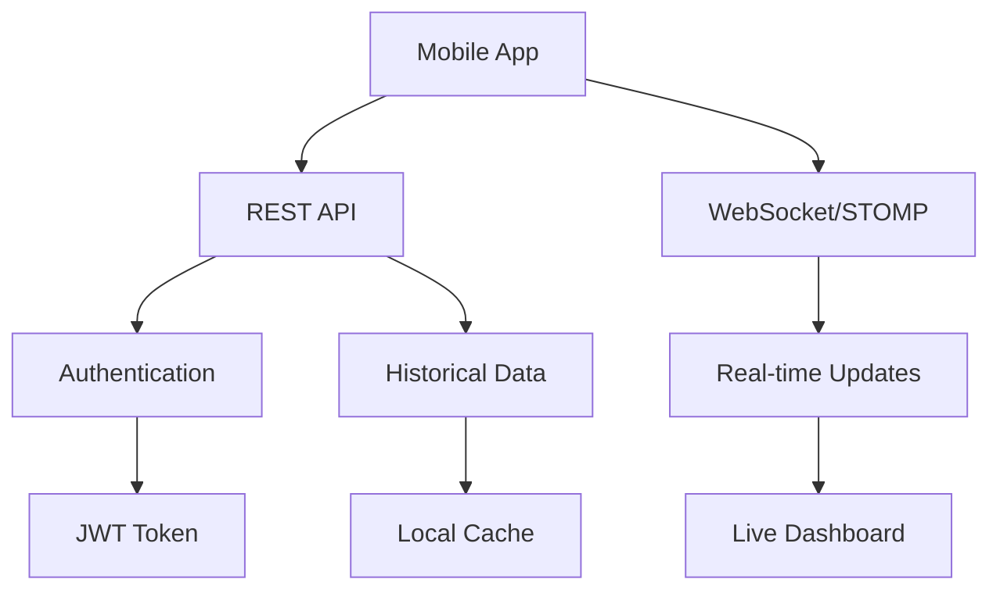

## Overview

This guide covers integration patterns for consuming the Invernaderos API in native mobile applications. The API provides REST endpoints for historical data and WebSocket connections for real-time greenhouse monitoring.

**API Base URL**: `https://api.invernaderos.example.com/api/v1`

## Architecture Overview



## Platform-Specific Setup

<CodeGroup>
```swift iOS (Swift)
// Package.swift dependencies
.package(url: "https://github.com/Alamofire/Alamofire.git", from: "5.8.0"),
.package(url: "https://github.com/daltoniam/Starscream.git", from: "4.0.0"),

// Or CocoaPods
pod 'Alamofire', '~> 5.8'
pod 'Starscream', '~> 4.0'
pod 'SwiftyJSON', '~> 5.0'
```

```kotlin Android (Kotlin)
// build.gradle.kts
dependencies {
    // Networking
    implementation("com.squareup.retrofit2:retrofit:2.9.0")
    implementation("com.squareup.retrofit2:converter-gson:2.9.0")
    implementation("com.squareup.okhttp3:okhttp:4.12.0")
    implementation("com.squareup.okhttp3:logging-interceptor:4.12.0")
    
    // WebSocket
    implementation("com.squareup.okhttp3:okhttp:4.12.0")
    
    // Coroutines
    implementation("org.jetbrains.kotlinx:kotlinx-coroutines-android:1.7.3")
    
    // Lifecycle
    implementation("androidx.lifecycle:lifecycle-viewmodel-ktx:2.7.0")
    implementation("androidx.lifecycle:lifecycle-runtime-ktx:2.7.0")
}
```
</CodeGroup>

## Authentication Flow

### Android Implementation

<Steps>
  <Step title="Define API service interface">
    ```kotlin
    import retrofit2.Response
    import retrofit2.http.*
    
    data class LoginRequest(
        val username: String,
        val password: String
    )
    
    data class JwtResponse(
        val token: String,
        val type: String = "Bearer",
        val username: String,
        val roles: List<String>
    )
    
    interface AuthApi {
        @POST("auth/login")
        suspend fun login(@Body request: LoginRequest): Response<JwtResponse>
        
        @POST("auth/register")
        suspend fun register(@Body request: RegisterRequest): Response<JwtResponse>
    }
    ```
  </Step>
  
  <Step title="Create authentication manager">
    ```kotlin
    import android.content.Context
    import androidx.security.crypto.EncryptedSharedPreferences
    import androidx.security.crypto.MasterKey
    
    class AuthManager(context: Context) {
        private val masterKey = MasterKey.Builder(context)
            .setKeyScheme(MasterKey.KeyScheme.AES256_GCM)
            .build()
        
        private val securePrefs = EncryptedSharedPreferences.create(
            context,
            "secure_prefs",
            masterKey,
            EncryptedSharedPreferences.PrefKeyEncryptionScheme.AES256_SIV,
            EncryptedSharedPreferences.PrefValueEncryptionScheme.AES256_GCM
        )
        
        fun saveToken(token: String) {
            securePrefs.edit().putString("jwt_token", token).apply()
        }
        
        fun getToken(): String? {
            return securePrefs.getString("jwt_token", null)
        }
        
        fun clearToken() {
            securePrefs.edit().remove("jwt_token").apply()
        }
        
        fun isAuthenticated(): Boolean = getToken() != null
    }
    ```
  </Step>
  
  <Step title="Configure Retrofit with authentication">
    ```kotlin
    import okhttp3.Interceptor
    import okhttp3.OkHttpClient
    import okhttp3.logging.HttpLoggingInterceptor
    import retrofit2.Retrofit
    import retrofit2.converter.gson.GsonConverterFactory
    import java.util.concurrent.TimeUnit
    
    class ApiClient(private val authManager: AuthManager) {
        
        private val authInterceptor = Interceptor { chain ->
            val original = chain.request()
            val requestBuilder = original.newBuilder()
            
            authManager.getToken()?.let { token ->
                requestBuilder.addHeader("Authorization", "Bearer $token")
            }
            
            chain.proceed(requestBuilder.build())
        }
        
        private val loggingInterceptor = HttpLoggingInterceptor().apply {
            level = HttpLoggingInterceptor.Level.BODY
        }
        
        private val httpClient = OkHttpClient.Builder()
            .addInterceptor(authInterceptor)
            .addInterceptor(loggingInterceptor)
            .connectTimeout(30, TimeUnit.SECONDS)
            .readTimeout(30, TimeUnit.SECONDS)
            .build()
        
        private val retrofit = Retrofit.Builder()
            .baseUrl("https://api.invernaderos.example.com/api/v1/")
            .client(httpClient)
            .addConverterFactory(GsonConverterFactory.create())
            .build()
        
        val authApi: AuthApi = retrofit.create(AuthApi::class.java)
        val greenhouseApi: GreenhouseApi = retrofit.create(GreenhouseApi::class.java)
        val sensorApi: SensorApi = retrofit.create(SensorApi::class.java)
    }
    ```
  </Step>
</Steps>

### iOS Implementation

<Steps>
  <Step title="Create API models">
    ```swift
    import Foundation
    
    struct LoginRequest: Codable {
        let username: String
        let password: String
    }
    
    struct JwtResponse: Codable {
        let token: String
        let type: String
        let username: String
        let roles: [String]
    }
    
    enum ApiError: Error {
        case networkError
        case authenticationError
        case invalidResponse
        case serverError(Int)
    }
    ```
  </Step>
  
  <Step title="Implement token manager">
    ```swift
    import Security
    
    class KeychainManager {
        static let shared = KeychainManager()
        private let service = "com.invernaderos.api"
        
        func saveToken(_ token: String) {
            let data = token.data(using: .utf8)!
            
            let query: [String: Any] = [
                kSecClass as String: kSecClassGenericPassword,
                kSecAttrService as String: service,
                kSecAttrAccount as String: "jwt_token",
                kSecValueData as String: data
            ]
            
            SecItemDelete(query as CFDictionary)
            SecItemAdd(query as CFDictionary, nil)
        }
        
        func getToken() -> String? {
            let query: [String: Any] = [
                kSecClass as String: kSecClassGenericPassword,
                kSecAttrService as String: service,
                kSecAttrAccount as String: "jwt_token",
                kSecReturnData as String: true
            ]
            
            var result: AnyObject?
            let status = SecItemCopyMatching(query as CFDictionary, &result)
            
            guard status == errSecSuccess,
                  let data = result as? Data,
                  let token = String(data: data, encoding: .utf8) else {
                return nil
            }
            
            return token
        }
        
        func clearToken() {
            let query: [String: Any] = [
                kSecClass as String: kSecClassGenericPassword,
                kSecAttrService as String: service,
                kSecAttrAccount as String: "jwt_token"
            ]
            
            SecItemDelete(query as CFDictionary)
        }
    }
    ```
  </Step>
  
  <Step title="Create API service">
    ```swift
    import Alamofire
    
    class ApiService {
        static let shared = ApiService()
        private let baseURL = "https://api.invernaderos.example.com/api/v1"
        
        func login(username: String, password: String) async throws -> String {
            let request = LoginRequest(username: username, password: password)
            
            let response = try await AF.request(
                "\(baseURL)/auth/login",
                method: .post,
                parameters: request,
                encoder: JSONParameterEncoder.default
            )
            .validate()
            .serializingDecodable(JwtResponse.self)
            .value
            
            KeychainManager.shared.saveToken(response.token)
            return response.token
        }
        
        func request<T: Decodable>(
            _ endpoint: String,
            method: HTTPMethod = .get,
            parameters: Parameters? = nil
        ) async throws -> T {
            guard let token = KeychainManager.shared.getToken() else {
                throw ApiError.authenticationError
            }
            
            let headers: HTTPHeaders = [
                "Authorization": "Bearer \(token)"
            ]
            
            return try await AF.request(
                "\(baseURL)\(endpoint)",
                method: method,
                parameters: parameters,
                headers: headers
            )
            .validate()
            .serializingDecodable(T.self)
            .value
        }
    }
    ```
  </Step>
</Steps>

<Note>
Use **platform-specific secure storage** for JWT tokens:
- Android: `EncryptedSharedPreferences` with AES256-GCM encryption
- iOS: `Keychain Services` with proper access control
</Note>

## REST API Consumption

### Data Models

<CodeGroup>
```kotlin Android
import com.google.gson.annotations.SerializedName
import java.time.Instant

data class RealDataDto(
    val timestamp: Instant,
    
    @SerializedName("TEMPERATURA INVERNADERO 01")
    val temperaturaInvernadero01: Double? = null,
    
    @SerializedName("HUMEDAD INVERNADERO 01")
    val humedadInvernadero01: Double? = null,
    
    @SerializedName("TEMPERATURA INVERNADERO 02")
    val temperaturaInvernadero02: Double? = null,
    
    @SerializedName("HUMEDAD INVERNADERO 02")
    val humedadInvernadero02: Double? = null,
    
    @SerializedName("INVERNADERO_01_SECTOR_01")
    val invernadero01Sector01: Double? = null,
    
    @SerializedName("INVERNADERO_01_EXTRACTOR")
    val invernadero01Extractor: Double? = null,
    
    val greenhouseId: String? = null,
    val tenantId: String? = null
)

data class SensorReadingResponse(
    val time: Instant,
    val sensorId: String,
    val greenhouseId: String,
    val sensorType: String,
    val value: Double,
    val unit: String?
)
```

```swift iOS
import Foundation

struct RealDataDto: Codable {
    let timestamp: Date
    let temperaturaInvernadero01: Double?
    let humedadInvernadero01: Double?
    let temperaturaInvernadero02: Double?
    let humedadInvernadero02: Double?
    let invernadero01Sector01: Double?
    let invernadero01Extractor: Double?
    let greenhouseId: String?
    let tenantId: String?
    
    enum CodingKeys: String, CodingKey {
        case timestamp
        case temperaturaInvernadero01 = "TEMPERATURA INVERNADERO 01"
        case humedadInvernadero01 = "HUMEDAD INVERNADERO 01"
        case temperaturaInvernadero02 = "TEMPERATURA INVERNADERO 02"
        case humedadInvernadero02 = "HUMEDAD INVERNADERO 02"
        case invernadero01Sector01 = "INVERNADERO_01_SECTOR_01"
        case invernadero01Extractor = "INVERNADERO_01_EXTRACTOR"
        case greenhouseId
        case tenantId
    }
}

struct SensorReadingResponse: Codable {
    let time: Date
    let sensorId: String
    let greenhouseId: String
    let sensorType: String
    let value: Double
    let unit: String?
}
```
</CodeGroup>

### API Interfaces

<CodeGroup>
```kotlin Android
interface GreenhouseApi {
    @GET("greenhouse/messages/recent")
    suspend fun getRecentMessages(
        @Query("tenantId") tenantId: String?,
        @Query("limit") limit: Int = 100
    ): Response<List<RealDataDto>>
    
    @GET("greenhouse/messages/range")
    suspend fun getMessagesByTimeRange(
        @Query("tenantId") tenantId: String?,
        @Query("from") from: String,
        @Query("to") to: String
    ): Response<List<RealDataDto>>
    
    @GET("greenhouse/cache/info")
    suspend fun getCacheInfo(
        @Query("tenantId") tenantId: String?
    ): Response<Map<String, Any>>
}

interface SensorApi {
    @GET("sensors/latest")
    suspend fun getLatestReadings(
        @Query("greenhouseId") greenhouseId: String?,
        @Query("limit") limit: Int = 10
    ): Response<List<SensorReadingResponse>>
    
    @GET("sensors/by-greenhouse/{greenhouseId}")
    suspend fun getReadingsByGreenhouse(
        @PathVariable greenhouseId: String,
        @Query("hours") hours: Long = 24
    ): Response<List<SensorReadingResponse>>
    
    @GET("sensors/current")
    suspend fun getCurrentSensorValues(
        @Query("greenhouseId") greenhouseId: Long
    ): Response<Map<String, Any>>
}
```

```swift iOS
extension ApiService {
    func getRecentMessages(
        tenantId: String? = nil,
        limit: Int = 100
    ) async throws -> [RealDataDto] {
        var params: Parameters = ["limit": limit]
        if let tenantId = tenantId {
            params["tenantId"] = tenantId
        }
        
        return try await request(
            "/greenhouse/messages/recent",
            parameters: params
        )
    }
    
    func getMessagesByTimeRange(
        tenantId: String? = nil,
        from: Date,
        to: Date
    ) async throws -> [RealDataDto] {
        let formatter = ISO8601DateFormatter()
        var params: Parameters = [
            "from": formatter.string(from: from),
            "to": formatter.string(from: to)
        ]
        
        if let tenantId = tenantId {
            params["tenantId"] = tenantId
        }
        
        return try await request(
            "/greenhouse/messages/range",
            parameters: params
        )
    }
    
    func getLatestSensorReadings(
        greenhouseId: String? = nil,
        limit: Int = 10
    ) async throws -> [SensorReadingResponse] {
        var params: Parameters = ["limit": limit]
        if let greenhouseId = greenhouseId {
            params["greenhouseId"] = greenhouseId
        }
        
        return try await request(
            "/sensors/latest",
            parameters: params
        )
    }
}
```
</CodeGroup>

## WebSocket Connection

### Android Implementation

```kotlin
import okhttp3.*
import kotlinx.coroutines.flow.MutableSharedFlow
import kotlinx.coroutines.flow.SharedFlow
import com.google.gson.Gson

class WebSocketManager(private val authManager: AuthManager) {
    private var webSocket: WebSocket? = null
    private val gson = Gson()
    
    private val _messages = MutableSharedFlow<RealDataDto>()
    val messages: SharedFlow<RealDataDto> = _messages
    
    private val _connectionState = MutableSharedFlow<ConnectionState>()
    val connectionState: SharedFlow<ConnectionState> = _connectionState
    
    fun connect() {
        val token = authManager.getToken() ?: return
        
        val client = OkHttpClient.Builder()
            .pingInterval(30, TimeUnit.SECONDS)
            .build()
        
        val request = Request.Builder()
            .url("wss://api.invernaderos.example.com/ws/greenhouse")
            .build()
        
        webSocket = client.newWebSocket(request, object : WebSocketListener() {
            override fun onOpen(webSocket: WebSocket, response: Response) {
                _connectionState.tryEmit(ConnectionState.Connected)
                
                // Send STOMP CONNECT
                val connectFrame = """
                    CONNECT
                    accept-version:1.2
                    authorization:Bearer $token
                    
                    \u0000
                """.trimIndent()
                webSocket.send(connectFrame)
            }
            
            override fun onMessage(webSocket: WebSocket, text: String) {
                handleStompFrame(text)
            }
            
            override fun onClosing(webSocket: WebSocket, code: Int, reason: String) {
                _connectionState.tryEmit(ConnectionState.Disconnecting)
            }
            
            override fun onClosed(webSocket: WebSocket, code: Int, reason: String) {
                _connectionState.tryEmit(ConnectionState.Disconnected)
            }
            
            override fun onFailure(webSocket: WebSocket, t: Throwable, response: Response?) {
                _connectionState.tryEmit(ConnectionState.Error(t.message ?: "Unknown error"))
            }
        })
    }
    
    private fun handleStompFrame(frame: String) {
        when {
            frame.startsWith("CONNECTED") -> {
                // Subscribe to greenhouse messages
                val subscribeFrame = """
                    SUBSCRIBE
                    id:sub-0
                    destination:/topic/greenhouse/messages
                    
                    \u0000
                """.trimIndent()
                webSocket?.send(subscribeFrame)
            }
            
            frame.startsWith("MESSAGE") -> {
                val bodyStart = frame.indexOf("\n\n") + 2
                val body = frame.substring(bodyStart).trim('\u0000')
                
                try {
                    val message = gson.fromJson(body, RealDataDto::class.java)
                    _messages.tryEmit(message)
                } catch (e: Exception) {
                    e.printStackTrace()
                }
            }
        }
    }
    
    fun disconnect() {
        webSocket?.close(1000, "Client disconnecting")
        webSocket = null
    }
    
    sealed class ConnectionState {
        object Connected : ConnectionState()
        object Disconnecting : ConnectionState()
        object Disconnected : ConnectionState()
        data class Error(val message: String) : ConnectionState()
    }
}
```

### iOS Implementation

```swift
import Starscream
import Combine

class WebSocketManager: WebSocketDelegate {
    private var socket: WebSocket?
    private let messageSubject = PassthroughSubject<RealDataDto, Never>()
    private let connectionSubject = PassthroughSubject<ConnectionState, Never>()
    
    var messagePublisher: AnyPublisher<RealDataDto, Never> {
        messageSubject.eraseToAnyPublisher()
    }
    
    var connectionPublisher: AnyPublisher<ConnectionState, Never> {
        connectionSubject.eraseToAnyPublisher()
    }
    
    func connect() {
        guard let token = KeychainManager.shared.getToken() else { return }
        
        var request = URLRequest(url: URL(string: "wss://api.invernaderos.example.com/ws/greenhouse")!)
        request.timeoutInterval = 30
        
        socket = WebSocket(request: request)
        socket?.delegate = self
        socket?.connect()
    }
    
    func didReceive(event: WebSocketEvent, client: WebSocketClient) {
        switch event {
        case .connected(_):
            connectionSubject.send(.connected)
            sendStompConnect()
            
        case .text(let text):
            handleStompFrame(text)
            
        case .disconnected(let reason, let code):
            connectionSubject.send(.disconnected)
            
        case .error(let error):
            connectionSubject.send(.error(error?.localizedDescription ?? "Unknown error"))
            
        default:
            break
        }
    }
    
    private func sendStompConnect() {
        guard let token = KeychainManager.shared.getToken() else { return }
        
        let frame = """
        CONNECT
        accept-version:1.2
        authorization:Bearer \(token)
        
        \u{0000}
        """
        
        socket?.write(string: frame)
    }
    
    private func handleStompFrame(_ frame: String) {
        if frame.hasPrefix("CONNECTED") {
            subscribeToMessages()
        } else if frame.hasPrefix("MESSAGE") {
            if let bodyStart = frame.range(of: "\n\n")?.upperBound {
                let body = frame[bodyStart...].trimmingCharacters(in: CharacterSet(charactersIn: "\u{0000}"))
                
                if let data = body.data(using: .utf8),
                   let message = try? JSONDecoder().decode(RealDataDto.self, from: data) {
                    messageSubject.send(message)
                }
            }
        }
    }
    
    private func subscribeToMessages() {
        let frame = """
        SUBSCRIBE
        id:sub-0
        destination:/topic/greenhouse/messages
        
        \u{0000}
        """
        
        socket?.write(string: frame)
    }
    
    func disconnect() {
        socket?.disconnect()
    }
    
    enum ConnectionState {
        case connected
        case disconnected
        case error(String)
    }
}
```

<Note>
The WebSocket endpoint uses **STOMP protocol** over WebSocket. Always send a STOMP CONNECT frame before subscribing to topics.
</Note>

## Offline Data Handling

### Android Room Database

<Steps>
  <Step title="Define Room entities">
    ```kotlin
    import androidx.room.*
    import java.time.Instant
    
    @Entity(tableName = "sensor_readings")
    data class SensorReadingEntity(
        @PrimaryKey(autoGenerate = true) val id: Long = 0,
        val timestamp: Long,
        val sensorId: String,
        val greenhouseId: String,
        val value: Double,
        val unit: String?,
        val synced: Boolean = false
    )
    
    @Dao
    interface SensorReadingDao {
        @Insert(onConflict = OnConflictStrategy.REPLACE)
        suspend fun insert(reading: SensorReadingEntity)
        
        @Insert(onConflict = OnConflictStrategy.REPLACE)
        suspend fun insertAll(readings: List<SensorReadingEntity>)
        
        @Query("SELECT * FROM sensor_readings WHERE greenhouseId = :greenhouseId ORDER BY timestamp DESC LIMIT :limit")
        suspend fun getRecentReadings(greenhouseId: String, limit: Int): List<SensorReadingEntity>
        
        @Query("SELECT * FROM sensor_readings WHERE synced = 0")
        suspend fun getUnsyncedReadings(): List<SensorReadingEntity>
        
        @Query("UPDATE sensor_readings SET synced = 1 WHERE id IN (:ids)")
        suspend fun markAsSynced(ids: List<Long>)
        
        @Query("DELETE FROM sensor_readings WHERE timestamp < :timestamp")
        suspend fun deleteOldReadings(timestamp: Long)
    }
    
    @Database(entities = [SensorReadingEntity::class], version = 1)
    abstract class AppDatabase : RoomDatabase() {
        abstract fun sensorReadingDao(): SensorReadingDao
    }
    ```
  </Step>
  
  <Step title="Implement cache-first repository">
    ```kotlin
    class GreenhouseRepository(
        private val api: GreenhouseApi,
        private val dao: SensorReadingDao,
        private val networkMonitor: NetworkMonitor
    ) {
        
        suspend fun getRecentReadings(
            greenhouseId: String,
            limit: Int = 100
        ): List<SensorReadingResponse> {
            // Try network first
            if (networkMonitor.isConnected()) {
                try {
                    val response = api.getReadingsByGreenhouse(greenhouseId, 24)
                    if (response.isSuccessful) {
                        response.body()?.let { readings ->
                            // Cache the results
                            val entities = readings.map { it.toEntity() }
                            dao.insertAll(entities)
                            return readings
                        }
                    }
                } catch (e: Exception) {
                    // Fall through to cache
                }
            }
            
            // Fall back to cache
            val cachedReadings = dao.getRecentReadings(greenhouseId, limit)
            return cachedReadings.map { it.toResponse() }
        }
        
        suspend fun syncPendingData() {
            if (!networkMonitor.isConnected()) return
            
            val unsyncedReadings = dao.getUnsyncedReadings()
            if (unsyncedReadings.isEmpty()) return
            
            try {
                // Batch sync to server
                // Implementation depends on your API
                
                // Mark as synced
                dao.markAsSynced(unsyncedReadings.map { it.id })
            } catch (e: Exception) {
                // Retry later
            }
        }
        
        suspend fun cleanupOldData(daysToKeep: Int = 30) {
            val cutoffTime = System.currentTimeMillis() - (daysToKeep * 24 * 60 * 60 * 1000L)
            dao.deleteOldReadings(cutoffTime)
        }
    }
    ```
  </Step>
  
  <Step title="Setup WorkManager for sync">
    ```kotlin
    import androidx.work.*
    import java.util.concurrent.TimeUnit
    
    class SyncWorker(
        context: Context,
        params: WorkerParameters
    ) : CoroutineWorker(context, params) {
        
        override suspend fun doWork(): Result {
            val repository = (applicationContext as App).repository
            
            return try {
                repository.syncPendingData()
                repository.cleanupOldData()
                Result.success()
            } catch (e: Exception) {
                Result.retry()
            }
        }
    }
    
    // Schedule periodic sync
    val syncWorkRequest = PeriodicWorkRequestBuilder<SyncWorker>(
        15, TimeUnit.MINUTES,
        5, TimeUnit.MINUTES
    )
        .setConstraints(
            Constraints.Builder()
                .setRequiredNetworkType(NetworkType.CONNECTED)
                .build()
        )
        .build()
    
    WorkManager.getInstance(context)
        .enqueueUniquePeriodicWork(
            "sync_greenhouse_data",
            ExistingPeriodicWorkPolicy.KEEP,
            syncWorkRequest
        )
    ```
  </Step>
</Steps>

### iOS Core Data

<Steps>
  <Step title="Define Core Data model">
    ```swift
    import CoreData
    
    @objc(SensorReadingEntity)
    class SensorReadingEntity: NSManagedObject {
        @NSManaged var id: UUID
        @NSManaged var timestamp: Date
        @NSManaged var sensorId: String
        @NSManaged var greenhouseId: String
        @NSManaged var value: Double
        @NSManaged var unit: String?
        @NSManaged var synced: Bool
    }
    
    extension SensorReadingEntity {
        @nonobjc class func fetchRequest() -> NSFetchRequest<SensorReadingEntity> {
            return NSFetchRequest<SensorReadingEntity>(entityName: "SensorReadingEntity")
        }
    }
    ```
  </Step>
  
  <Step title="Implement repository with offline support">
    ```swift
    import CoreData
    
    class GreenhouseRepository {
        private let apiService: ApiService
        private let context: NSManagedObjectContext
        private let networkMonitor: NetworkMonitor
        
        init(
            apiService: ApiService,
            context: NSManagedObjectContext,
            networkMonitor: NetworkMonitor
        ) {
            self.apiService = apiService
            self.context = context
            self.networkMonitor = networkMonitor
        }
        
        func getRecentReadings(
            greenhouseId: String,
            limit: Int = 100
        ) async throws -> [SensorReadingResponse] {
            // Try network first
            if networkMonitor.isConnected {
                do {
                    let readings: [SensorReadingResponse] = try await apiService.request(
                        "/sensors/by-greenhouse/\(greenhouseId)",
                        parameters: ["hours": 24]
                    )
                    
                    // Cache the results
                    await cacheReadings(readings)
                    return readings
                } catch {
                    // Fall through to cache
                }
            }
            
            // Fall back to cache
            return try await fetchCachedReadings(greenhouseId: greenhouseId, limit: limit)
        }
        
        private func cacheReadings(_ readings: [SensorReadingResponse]) async {
            await context.perform {
                for reading in readings {
                    let entity = SensorReadingEntity(context: self.context)
                    entity.id = UUID()
                    entity.timestamp = reading.time
                    entity.sensorId = reading.sensorId
                    entity.greenhouseId = reading.greenhouseId
                    entity.value = reading.value
                    entity.unit = reading.unit
                    entity.synced = true
                }
                
                try? self.context.save()
            }
        }
        
        private func fetchCachedReadings(
            greenhouseId: String,
            limit: Int
        ) async throws -> [SensorReadingResponse] {
            try await context.perform {
                let request = SensorReadingEntity.fetchRequest()
                request.predicate = NSPredicate(format: "greenhouseId == %@", greenhouseId)
                request.sortDescriptors = [NSSortDescriptor(key: "timestamp", ascending: false)]
                request.fetchLimit = limit
                
                let entities = try self.context.fetch(request)
                return entities.map { $0.toResponse() }
            }
        }
    }
    ```
  </Step>
</Steps>

<Note>
Implement **offline-first architecture** for better user experience:
- Cache API responses locally
- Queue failed requests for retry
- Sync data when network becomes available
- Display cached data during offline mode
</Note>

## Best Practices

### Performance Optimization

1. **Pagination**: Load data in chunks to reduce memory usage
2. **Image Caching**: Use Glide (Android) or SDWebImage (iOS) for image caching
3. **Background Sync**: Use WorkManager (Android) or Background Tasks (iOS)
4. **Connection Pooling**: Reuse HTTP connections
5. **Request Debouncing**: Avoid excessive API calls

### Security

1. **Certificate Pinning**: Implement SSL pinning for production
2. **Token Rotation**: Refresh tokens before expiration
3. **Secure Storage**: Never store tokens in plain text
4. **HTTPS Only**: Always use HTTPS endpoints
5. **Request Signing**: Consider signing sensitive requests

### Error Handling

```kotlin
// Android
sealed class Resource<T> {
    data class Success<T>(val data: T) : Resource<T>()
    data class Error<T>(val message: String, val data: T? = null) : Resource<T>()
    class Loading<T> : Resource<T>()
}

class GreenhouseViewModel(private val repository: GreenhouseRepository) : ViewModel() {
    private val _uiState = MutableStateFlow<Resource<List<RealDataDto>>>(Resource.Loading())
    val uiState: StateFlow<Resource<List<RealDataDto>>> = _uiState
    
    fun loadRecentData(tenantId: String? = null) {
        viewModelScope.launch {
            _uiState.value = Resource.Loading()
            
            try {
                val data = repository.getRecentMessages(tenantId, 100)
                _uiState.value = Resource.Success(data)
            } catch (e: Exception) {
                _uiState.value = Resource.Error(
                    message = e.localizedMessage ?: "Unknown error",
                    data = null
                )
            }
        }
    }
}
```

## Testing

### Mock API Responses

<CodeGroup>
```kotlin Android
@RunWith(MockitoJUnitRunner::class)
class GreenhouseRepositoryTest {
    @Mock
    private lateinit var api: GreenhouseApi
    
    @Mock
    private lateinit var dao: SensorReadingDao
    
    private lateinit var repository: GreenhouseRepository
    
    @Before
    fun setup() {
        repository = GreenhouseRepository(api, dao, NetworkMonitor())
    }
    
    @Test
    fun `getRecentReadings returns network data when available`() = runTest {
        val mockData = listOf(
            SensorReadingResponse(
                time = Instant.now(),
                sensorId = "SENSOR_01",
                greenhouseId = "001",
                sensorType = "TEMPERATURE",
                value = 25.5,
                unit = "°C"
            )
        )
        
        `when`(api.getReadingsByGreenhouse("001", 24))
            .thenReturn(Response.success(mockData))
        
        val result = repository.getRecentReadings("001")
        
        assertEquals(mockData, result)
        verify(dao).insertAll(any())
    }
}
```

```swift iOS
import XCTest
@testable import InvernaderosApp

class GreenhouseRepositoryTests: XCTestCase {
    var repository: GreenhouseRepository!
    var mockApiService: MockApiService!
    var mockContext: NSManagedObjectContext!
    
    override func setUp() {
        super.setUp()
        mockApiService = MockApiService()
        mockContext = createInMemoryContext()
        repository = GreenhouseRepository(
            apiService: mockApiService,
            context: mockContext,
            networkMonitor: MockNetworkMonitor()
        )
    }
    
    func testGetRecentReadingsReturnsNetworkData() async throws {
        let mockData = [
            SensorReadingResponse(
                time: Date(),
                sensorId: "SENSOR_01",
                greenhouseId: "001",
                sensorType: "TEMPERATURE",
                value: 25.5,
                unit: "°C"
            )
        ]
        
        mockApiService.mockResponse = mockData
        
        let result = try await repository.getRecentReadings(greenhouseId: "001")
        
        XCTAssertEqual(result.count, 1)
        XCTAssertEqual(result.first?.sensorId, "SENSOR_01")
    }
}
```
</CodeGroup>

## Next Steps

- [Kotlin Multiplatform SDK](/integration/sdks/kotlin-multiplatform) - Shared code for Android/iOS
- [WebSocket Integration](/integration/mqtt/websocket) - Real-time data streaming
- [API Reference](/api-reference) - Complete API documentation