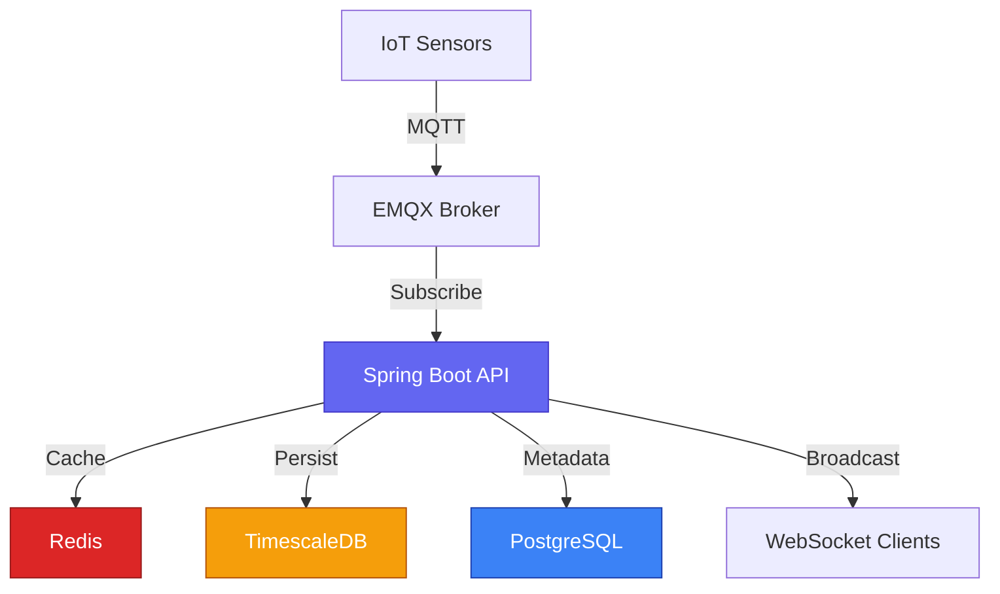

# Welcome to Invernaderos API

The **Invernaderos API** is a production-ready IoT greenhouse monitoring system that enables real-time sensor data collection, storage, and analysis for agricultural operations. Built with modern technologies and designed for scalability, it provides a robust platform for monitoring environmental conditions across multiple greenhouses.

<CardGroup cols={2}>
  <Card title="Quick Start" icon="rocket" href="/quickstart">
    Get your API running in under 5 minutes with Docker Compose
  </Card>
  <Card title="Architecture" icon="diagram-project" href="/architecture">
    Understand the system design and data flow
  </Card>
  <Card title="API Reference" icon="code" href="/api-reference">
    Explore REST endpoints and authentication
  </Card>
  <Card title="WebSocket" icon="satellite-dish" href="/websocket">
    Real-time sensor data streaming
  </Card>
</CardGroup>

## What is Invernaderos API?

Invernaderos API is a **multi-tenant IoT platform** that receives sensor data from greenhouse devices via MQTT, stores time-series data in TimescaleDB, caches recent readings in Redis for fast access, and broadcasts real-time updates to connected clients via WebSocket/STOMP.

### Key Features

<CardGroup cols={2}>
  <Card title="Multi-Tenant" icon="building">
    **Isolated Data by Tenant**
    
    Complete data isolation with UUID-based tenant identification. Each agricultural company gets their own secure data space.
  </Card>
  
  <Card title="MQTT Integration" icon="network-wired">
    **Industry-Standard IoT**
    
    Built on MQTT protocol with EMQX broker. Topics: `GREENHOUSE/{tenantId}` for multi-tenant routing.
  </Card>
  
  <Card title="Time-Series Database" icon="database">
    **Optimized for Sensor Data**
    
    TimescaleDB with automatic compression, 2-year retention policy, and continuous aggregates for hourly/daily statistics.
  </Card>
  
  <Card title="Real-Time WebSocket" icon="bolt">
    **Instant Updates**
    
    STOMP over WebSocket pushes sensor readings to clients instantly. No polling required.
  </Card>
  
  <Card title="Redis Caching" icon="gauge-high">
    **Lightning Fast**
    
    Last 1000 messages cached in Redis Sorted Set. Response time in milliseconds for recent data queries.
  </Card>
  
  <Card title="JWT Authentication" icon="lock">
    **Secure Access**
    
    Bearer token authentication with role-based access control. Password reset via email.
  </Card>
</CardGroup>

## Technology Stack

<CardGroup cols={3}>
  <Card title="Spring Boot 3.5.7" icon="leaf">
    Modern Java framework with Jakarta EE 10+
  </Card>
  <Card title="Kotlin 2.2.21" icon="k">
    Concise, type-safe language with K2 compiler
  </Card>
  <Card title="Java 21 LTS" icon="coffee">
    Latest LTS with virtual threads and pattern matching
  </Card>
  <Card title="TimescaleDB" icon="clock">
    PostgreSQL 16 + TimescaleDB for time-series
  </Card>
  <Card title="Redis 7" icon="server">
    In-memory cache with Lettuce client
  </Card>
  <Card title="EMQX" icon="envelope">
    Enterprise MQTT broker with WebSocket support
  </Card>
</CardGroup>

## System Architecture Overview



### Data Flow

<Steps>
  <Step title="Sensors Publish">
    Greenhouse IoT devices publish sensor readings to MQTT topic `GREENHOUSE/{tenantId}` every 5-10 seconds.
  </Step>
  
  <Step title="MQTT Listener">
    Spring Integration MQTT adapter receives messages and routes to `GreenhouseDataListener`.
  </Step>
  
  <Step title="Processing Pipeline">
    `MqttMessageProcessor` processes each message:
    - Parses JSON payload (22 fields: temperature, humidity, sectors, extractors)
    - Caches in Redis Sorted Set (last 1000 messages)
    - Transforms to 22 `SensorReading` entities (one per field)
    - Batch inserts to TimescaleDB
    - Publishes Spring `ApplicationEvent`
  </Step>
  
  <Step title="WebSocket Broadcast">
    `GreenhouseWebSocketHandler` listens to event and broadcasts `RealDataDto` to all connected clients on `/topic/greenhouse/messages`.
  </Step>
  
  <Step title="Clients Receive">
    Mobile/web apps receive real-time updates via WebSocket. Historical data queried via REST API.
  </Step>
</Steps>

## Real-World Sensor Data

The system handles real greenhouse sensor data with **22 fields per message**:

<CodeGroup>
```json Sample MQTT Payload
{
  "TEMPERATURA INVERNADERO 01": 24.5,
  "HUMEDAD INVERNADERO 01": 65.3,
  "TEMPERATURA INVERNADERO 02": 23.8,
  "HUMEDAD INVERNADERO 02": 68.2,
  "TEMPERATURA INVERNADERO 03": 25.1,
  "HUMEDAD INVERNADERO 03": 64.7,
  "INVERNADERO_01_SECTOR_01": 1.0,
  "INVERNADERO_01_SECTOR_02": 0.0,
  "INVERNADERO_01_SECTOR_03": 1.0,
  "INVERNADERO_01_SECTOR_04": 0.0,
  "INVERNADERO_02_SECTOR_01": 1.0,
  "INVERNADERO_02_SECTOR_02": 1.0,
  "INVERNADERO_02_SECTOR_03": 0.0,
  "INVERNADERO_02_SECTOR_04": 1.0,
  "INVERNADERO_03_SECTOR_01": 0.0,
  "INVERNADERO_03_SECTOR_02": 1.0,
  "INVERNADERO_03_SECTOR_03": 1.0,
  "INVERNADERO_03_SECTOR_04": 0.0,
  "INVERNADERO_01_EXTRACTOR": 850.5,
  "INVERNADERO_02_EXTRACTOR": 920.3,
  "INVERNADERO_03_EXTRACTOR": 780.2,
  "RESERVA": 0.0
}
```

```kotlin RealDataDto (Kotlin)
data class RealDataDto(
    val timestamp: Instant,
    @JsonProperty("TEMPERATURA INVERNADERO 01") val temperaturaInvernadero01: Double?,
    @JsonProperty("HUMEDAD INVERNADERO 01") val humedadInvernadero01: Double?,
    // ... 3 greenhouses with temp/humidity
    @JsonProperty("INVERNADERO_01_SECTOR_01") val invernadero01Sector01: Double?,
    // ... 12 sector fields
    @JsonProperty("INVERNADERO_01_EXTRACTOR") val invernadero01Extractor: Double?,
    // ... 3 extractor fields
    val greenhouseId: String?,
    val tenantId: String?
)
```

```sql TimescaleDB Schema
CREATE TABLE iot.sensor_readings (
    time TIMESTAMPTZ NOT NULL,
    sensor_id VARCHAR(50) NOT NULL,
    greenhouse_id BIGINT NOT NULL,
    tenant_id BIGINT,
    sensor_type VARCHAR(30) NOT NULL,
    value DOUBLE PRECISION NOT NULL,
    unit VARCHAR(20),
    PRIMARY KEY (time, sensor_id)
);

-- Convert to hypertable (7-day chunks)
SELECT create_hypertable('iot.sensor_readings', 'time', 
    chunk_time_interval => INTERVAL '7 days');
```
</CodeGroup>

<Note>
  **Data Transformation**: One JSON payload (22 fields) → 22 database rows. Each numeric field becomes a separate `SensorReading` entity for normalized time-series queries.
</Note>

## Multi-Tenant Architecture

The system supports complete tenant isolation with **UUID-based tenant IDs**:

### MQTT Topic Structure

- **Legacy Format** (backward compatible): `GREENHOUSE` → maps to `tenantId = "DEFAULT"`
- **Multi-Tenant Format**: `GREENHOUSE/{tenantId}`
  - `GREENHOUSE/SARA` → tenantId = "SARA" (Vivero Sara)
  - `GREENHOUSE/001` → tenantId = "001"
  - `GREENHOUSE/NARANJOS` → tenantId = "NARANJOS" (Los Naranjos farm)

### Database Isolation

All tables include `tenant_id UUID` for filtering:

- **PostgreSQL Metadata**: `tenants`, `greenhouses`, `sensors`, `actuators`, `users`, `alerts`
- **TimescaleDB**: `sensor_readings` with indexed `tenant_id` column
- **Redis Cache**: Keys include tenant context: `greenhouse:messages:{tenantId}`

<Warning>
  **Important**: Existing sensor data has `NULL tenant_id` and requires manual migration. See Migration Guide for steps to populate tenant associations.
</Warning>

## Use Cases

<CardGroup cols={2}>
  <Card title="Agricultural Companies" icon="tractor">
    Monitor multiple greenhouses across different locations. Track temperature, humidity, and environmental factors in real-time.
  </Card>
  
  <Card title="Research Institutions" icon="flask">
    Collect long-term environmental data for agricultural research. Analyze trends and optimize growing conditions.
  </Card>
  
  <Card title="IoT Integrators" icon="microchip">
    Build custom dashboards and mobile apps on top of the API. Connect various sensor types and actuators.
  </Card>
  
  <Card title="Smart Farming" icon="leaf">
    Automate irrigation, ventilation, and climate control based on real-time sensor data and thresholds.
  </Card>
</CardGroup>

## Production Features

<CardGroup cols={2}>
  <Card title="Docker Ready" icon="docker">
    Multi-stage Dockerfile with optimized layers. Complete docker-compose.yaml for local development.
  </Card>
  
  <Card title="Kubernetes Deployment" icon="dharmachakra">
    Production K8s manifests with StatefulSets, PersistentVolumes, and health checks.
  </Card>
  
  <Card title="Health Monitoring" icon="heart-pulse">
    Spring Boot Actuator endpoints: `/actuator/health`, `/actuator/metrics`, `/actuator/prometheus`.
  </Card>
  
  <Card title="OpenAPI Documentation" icon="book">
    Interactive Swagger UI at `/swagger-ui.html` with try-it-out functionality.
  </Card>
  
  <Card title="Database Migrations" icon="database">
    Flyway-managed SQL migrations (V2-V11 executed). Versioned schema changes with checksum validation.
  </Card>
  
  <Card title="Connection Pooling" icon="circle-nodes">
    HikariCP pools: TimescaleDB (max 20), PostgreSQL (max 10), Redis Lettuce (max 100 connections).
  </Card>
</CardGroup>

## Performance Characteristics

<Info>
  **Throughput**: Handles 1000+ messages/second with batch inserts
  
  **Latency**: Redis cache responses in 1-5ms, TimescaleDB queries in 10-50ms
  
  **Storage**: TimescaleDB compression (7-day policy) reduces storage by ~90%
  
  **Retention**: 2-year data retention with automatic cleanup
  
  **Scaling**: Horizontal scaling with multiple API instances behind load balancer
</Info>

## Next Steps

<CardGroup cols={3}>
  <Card title="Quick Start" icon="rocket" href="/quickstart">
    Deploy with Docker in 5 minutes
  </Card>
  <Card title="Architecture" icon="diagram-project" href="/architecture">
    Deep dive into system design
  </Card>
  <Card title="API Docs" icon="code" href="/api-reference">
    Explore endpoints
  </Card>
</CardGroup>

---

**Built with** Spring Boot 3.5.7 • Kotlin 2.2.21 • Java 21 • TimescaleDB • Redis 7 • EMQX
